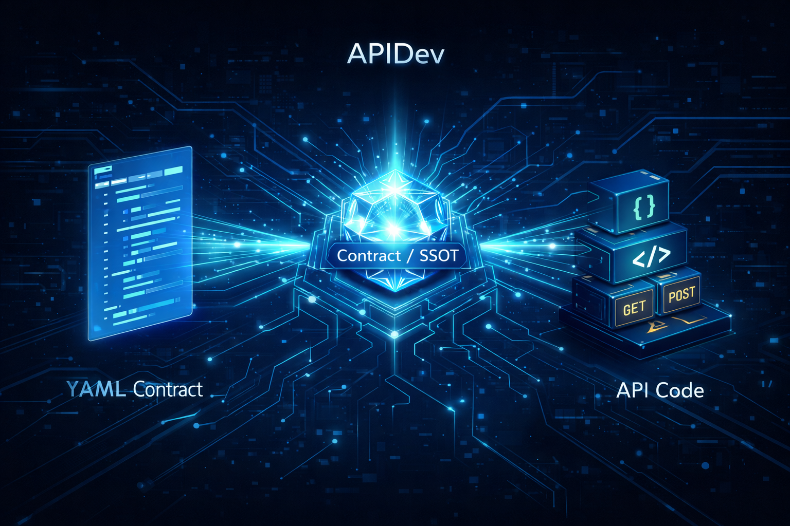

APIDev removes the routine around API contracts and the transport layer: it generates code skeletons from contracts, checks their integrity, and helps you safely regenerate artifacts without the fear of your code and OpenAPI drifting apart.

### What pain APIDev solves

In a typical service, every new endpoint repeats the same set of technical tasks: describe the contract, update request/response schemas, wire up routes, fix OpenAPI, remember the tests, and avoid breaking what already works. Over time, contracts, the transport layer, and documentation start to diverge, and onboarding new developers turns into a long dive into “how everything is wired here”.

#### Typical use cases

- **Onboarding new developers**: a single contract format and a predictable structure of generated code make it easier to get into the project — instead of reading spaghetti routes, a developer sees a single entrypoint organized by operations.
- **Fast start for new endpoints**: you describe the contract, and APIDev builds a deterministic skeleton: request/response models, operations, routes, and OpenAPI metadata.
- **Drift control in CI**: `apidev gen --check` guarantees that committed generated code matches the contracts — any divergence is caught before merge.

### What changes “before” and “after”

- **Less routine around the transport layer**: instead of manually wiring routes, schemas, and OpenAPI — a single generation command from contracts.
- **Contracts become the source of truth**: schemas, transport code, and documentation are synchronized, the risk of “forgot to update OpenAPI” goes away.
- **Safe regeneration**: deterministic output and a clear separation of generated/manual code let you safely update artifacts as many times as you need.
- **Transparent CI**: stable JSON output and predictable exit codes provide clear, machine-readable signals for the pipeline.

## Key capabilities

### Contracts as the central control point

APIDev builds everything around API contracts: you describe operations in YAML, the tool validates them and uses them as the single source of truth.

- **Loading YAML contracts**: reads project contracts and builds an operation model so that generation and validation rely on the same description.
- **Validation of basic rules**: `apidev validate` checks at least the uniqueness of `operation_id` and other critical invariants, reducing the risk of hidden conflicts.
- **Unified artifact format**: the structure of the generated zone (`operation_map.py`, `openapi_docs.py`, domain directories and models) is strictly normalized, which simplifies navigation and review.

### Transport skeleton generation without magic

APIDev generates repetitive technical layers while leaving business logic under your control.

- **Deterministic skeleton generation**: `apidev gen` creates the same skeleton for the same contracts, which is important for review and debugging.
- **Domain‑first structure**: generator output is organized by domains and operations, with separate request, response, and error models — it is easier to find the code you need.
- **Safe write boundary**: all writes are limited to the configured generated zone, manual code is not overwritten.
- **Scaffold flags under control**: `--scaffold` and `--no-scaffold` allow you to enable or disable generation of integration scaffolds for a particular run without changing the config.

### Drift control and CI integration

The tool is designed from the start to fit well into CI/CD pipelines and not turn into a “black box”.

- **Diff without side effects**: `apidev diff` builds a change plan and shows a per‑file diff preview without writing them to disk — convenient before the first generation run.
- **Drift checks in `--check` mode**: `apidev gen --check` compares contracts with already generated code and returns a non‑zero exit code when desynchronization is detected — an ideal gate for CI.
- **Machine‑readable diagnostics (`--json`)**: `validate`, `diff`, and `gen` can return JSON diagnostics with a unified schema — easy to parse in pipelines and tooling.
- **Normalized exit codes and drift statuses**: a single `drift/no-drift/error` matrix plus exit codes makes CLI behavior predictable for humans and automation.
- **Compatibility policy**: the `--compatibility-policy` flag (`warn`/`strict`) and baseline management via `--baseline-ref` let you gradually tighten compatibility rules.

### Developer experience

APIDev fits into the regular development workflow and doesn’t force monolithic changes.

- **Project initialization with a single command**: `apidev init` creates the initial `.apidev` structure, config, and base artifacts, without touching existing manual code unless the user explicitly asks.
- **Step‑by‑step workflow**: validate contracts, inspect the diff, apply changes or check for drift — each step is transparent and can be reproduced independently.
- **Clear help and errors**: all levels support `-h/--help`, error messages are suitable for CI logs and hint at the next step.

## apidev CLI

Below is an overview of the available commands and when to use them. The canonical generation command is `apidev gen`; the `apidev generate` alias is supported as a compatibility mechanism.

### Command overview

- `apidev init` — initialize the project structure and APIDev base artifacts.
- `apidev validate` — validate contracts and basic invariants.
- `apidev diff` — view the generation plan and diff without writing files.
- `apidev gen` — generate/apply changes or check for drift (in `--check` mode).

### apidev init

**When to use**

- you are starting a new service and want to immediately put contracts and generated code into a clear structure;
- you are adding APIDev to an existing project without breaking the current layout.

**Example**

```bash
apidev init
```

After this, the repository will contain the `.apidev` configuration and starter artifacts for further work.

### apidev validate

**When to use**

- before running `apidev diff`/`apidev gen` to make sure contracts are OK;
- as a quick local run before committing;
- as a separate step in CI for early feedback on contracts.

**Examples**

```bash
# basic contract validation
apidev validate

# same run, but with machine-readable output for CI
apidev validate --json
```

### apidev diff

**When to use**

- you want to understand what exactly will be generated or updated before files are written;
- you are checking which artifacts will change after modifications in contracts;
- you use it as a review step before `gen` in a local or team workflow.

**Examples**

```bash
# view the change plan without writing files
apidev diff

# the same diff, but in JSON format for analysis in CI/scripts
apidev diff --json
```

### apidev gen (canonical generation command)

**When to use**

- you want to apply changes to generated code based on updated contracts;
- you want to make sure the committed generated code matches the contracts (`--check` mode);
- you are configuring a CI gate that will not allow drift.

**Examples**

```bash
# apply changes (create/update generated artifacts)
apidev gen

# check for drift without writing files — a convenient CI gate
apidev gen --check

# generation with scaffold enabled for a particular run
apidev gen --scaffold
```

In the documentation and examples, `apidev gen` is used as the primary command; the `apidev generate` alias leads to the same behavior and exists for compatibility.

## Quick start: typical workflow

1. **Initialize the project**
   ```bash
   apidev init
   ```
2. **Describe or update contracts in YAML**  
   Place the contracts in the expected project structure (see the documentation for details).
3. **Validate the contracts**
   ```bash
   apidev validate
   ```
4. **See what will change**
   ```bash
   apidev diff
   ```
5. **Apply changes or configure a CI gate**  
   Locally:  
   In CI:  
   In this mode APIDev does not write files, but returns a machine‑readable drift report and a convenient status for the pipeline.

## Installation

Recommended installation method is Homebrew:

```bash
brew tap alexey-gladilin/devtools
brew install alexey-gladilin/devtools/apidev
```

Standalone binaries are also available in GitHub Releases:

- Releases page: `https://github.com/alexey-gladilin/apidev/releases/latest`
- Assets: `apidev-<version>-<os>-<arch>.zip` (Windows) or `apidev-<version>-<os>-<arch>.tar.gz` (Linux/macOS)

**Manual binary installation**

1. Open the latest release page.
2. Download the archive for your platform from the Assets section.
3. Unpack the archive and add `apidev` (or `apidev.exe` on Windows) to your `PATH`.

## Documentation

- `docs/README.md` — documentation map and index of sources of truth.
- `docs/product/vision.md` — product framing and target purpose of APIDev.
- `docs/architecture/architecture-overview.md` — architectural overview of the current state and key flows (`init`, `validate`, `diff`, `gen`).
- `docs/reference/cli-contract.md` — canonical CLI contract, flags, and JSON output format.
- `docs/roadmap.md` — historical snapshot of the roadmap and development direction.
- `docs/process/ai-workflow.md` — workflow for working with AI agents and operational recommendations.
