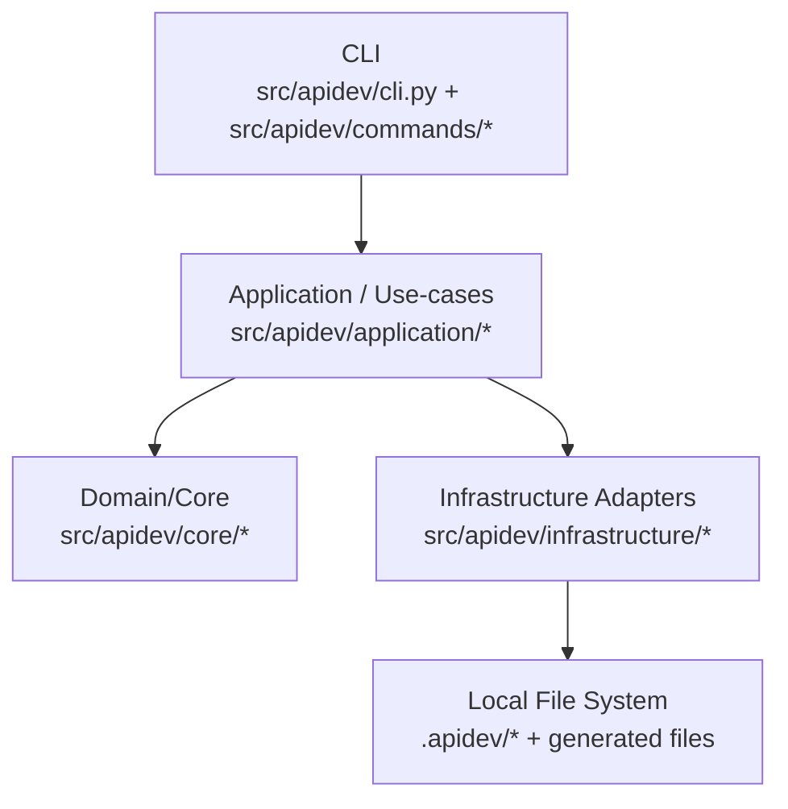
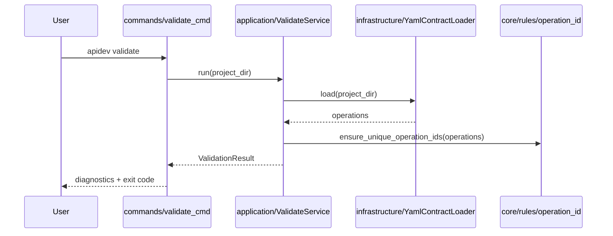
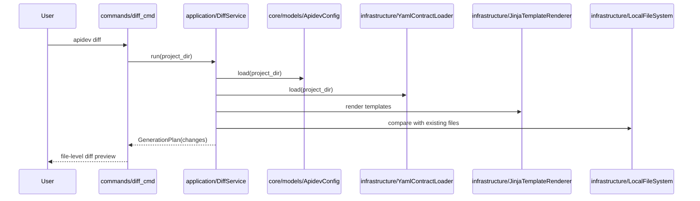
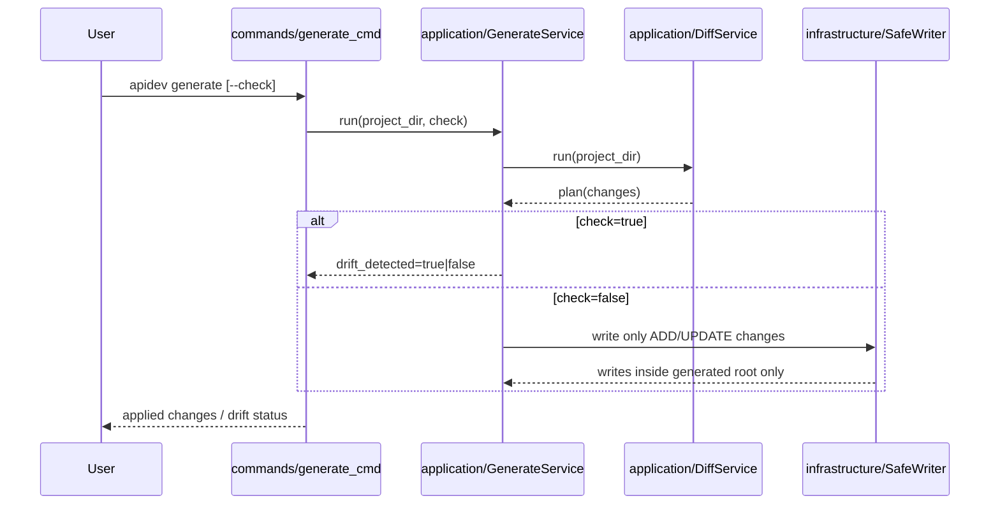
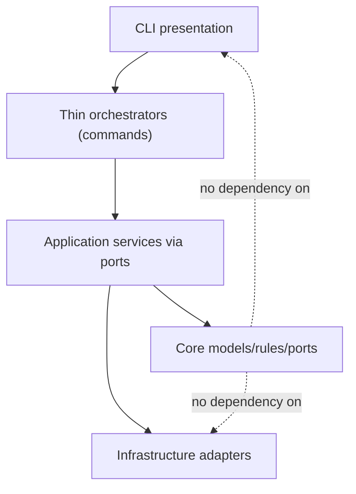

# APIDev Architecture

## Purpose

This document captures the current high-level architecture of APIDev and target refactoring direction for maintainability and architecture validation.

Authoritative behavior requirements remain in `openspec/specs/`.

## Architecture Document Set

For full architecture documentation (including C4 Level 1/2/3 and validation rules), use:

- `docs/architecture/README.md`
- `docs/architecture/c4-context.md`
- `docs/architecture/c4-container.md`
- `docs/architecture/c4-components.md`
- `docs/architecture/architecture-rules.md`

## As-Is Layered View

## Key Flow: Validate

## Key Flow: Diff

## Key Flow: Generate

## Target Refactoring Direction

## Design Principles

- Single Responsibility: command parsing/presentation, orchestration, domain logic, and adapters stay separated.
- Dependency direction: core does not depend on application/commands/infrastructure.
- DRY: configuration paths and pipeline steps have a single source.
- Safety: writes are constrained to generated root.
- Determinism: same contracts/templates/config produce the same generation output.

## Related Documents

- `docs/architecture/README.md`
- `docs/architecture/architecture-rules.md`
- `docs/architecture/validation-blueprint.md`
- `openspec/changes/add-apidev-cli-tool-architecture/specs/cli-tool-architecture/spec.md`
- `docs/apidev-concept-and-approach.md`

