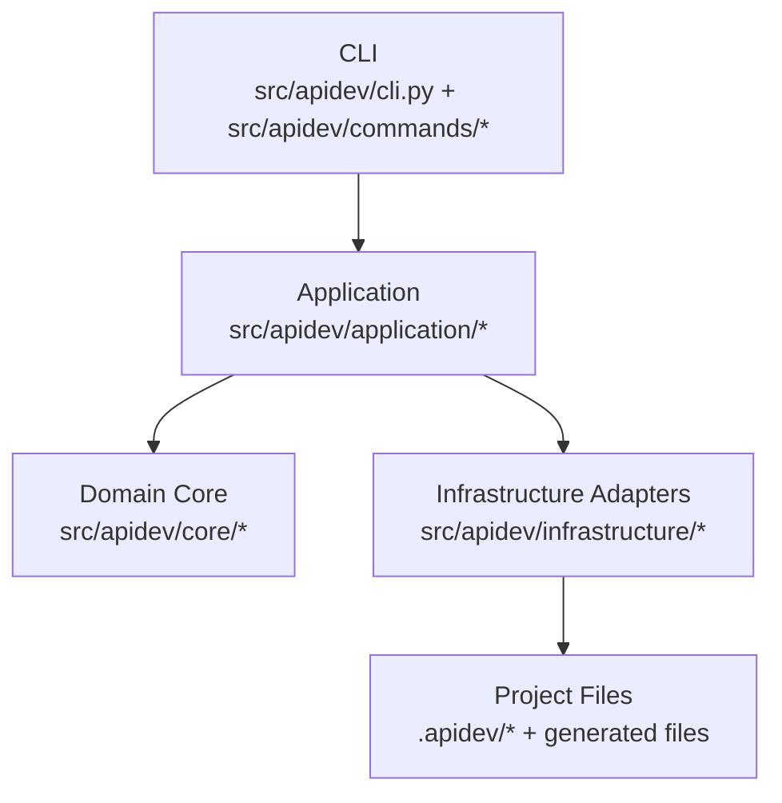
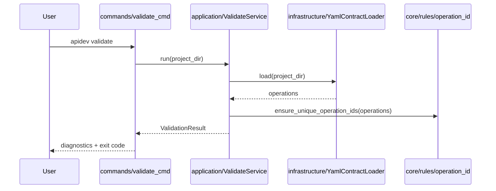
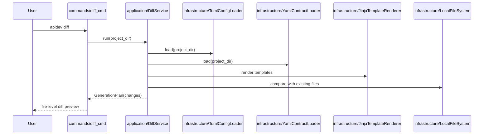
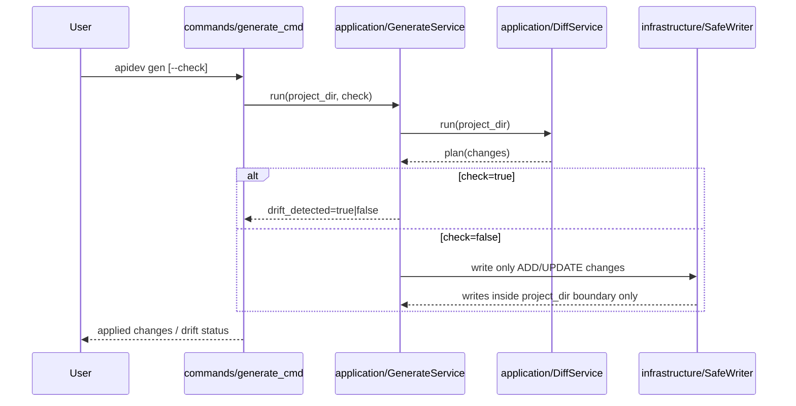

# Архитектурный Обзор APIDev

Статус: `Authoritative`

Этот документ фиксирует текущее архитектурное устройство APIDev и ближайшее направление эволюции. Нормативные правила детализируются в `architecture-rules.md`; этот файл является архитектурным baseline и входной точкой в as-is картину системы.

## Область действия

- `src/apidev/*`
- `tests/unit/architecture/*`
- `tests/contract/architecture/*`
- связанные архитектурные документы из `docs/architecture/*`

## Текущее состояние

APIDev — CLI-инструмент с прагматичной layered/onion архитектурой, где presentation, orchestration, domain core и infrastructure adapters разделены по ответственности.



### Основные свойства текущего baseline

- `commands/*` обслуживает CLI-вход, UX и composition root.
- `application/*` координирует use cases и pipeline.
- `core/*` содержит доменные модели, правила и порты.
- `infrastructure/*` владеет filesystem, YAML, TOML, Jinja2 и concrete adapters.
- generated/scaffold output ограничен write-boundary внутри `project_dir` с единым path-boundary policy.

## Ключевые потоки

### `init`

`apidev init` создает базовую рабочую структуру проекта и стартовые артефакты, не затрагивая уже существующие generated/manual зоны без явного действия пользователя.

### `validate`



### `diff`



### `gen`



## Направление зависимостей

```text
commands -> application -> core
application -> core.ports
infrastructure -> core.ports/core.models
commands -> infrastructure (composition root only)
```

Запрещенные направления раскрываются в `architecture-rules.md`.

## Ближайшее направление эволюции

### Ближайший target state

- сохранить layered/onion baseline;
- усилить boundary между domain core и parsing/adapters;
- удержать `application/*` в роли thin orchestration layer;
- развивать domain models в сторону richer semantics там, где действительно есть инварианты.

### Важная оговорка

Selective DDD для APIDev — это целевое архитектурное направление, а не утверждение, что весь текущий `core/*` уже является rich domain model layer. Часть моделей пока остается lightweight data carriers, и это учитывается в архитектурной документации.

## Связанные документы

- `docs/architecture/README.md`
- `docs/architecture/architecture-rules.md`
- `docs/architecture/generated-integration.md`
- `docs/architecture/validation-blueprint.md`
- `docs/architecture/patterns-and-naming.md`
- `docs/process/testing-strategy.md`
