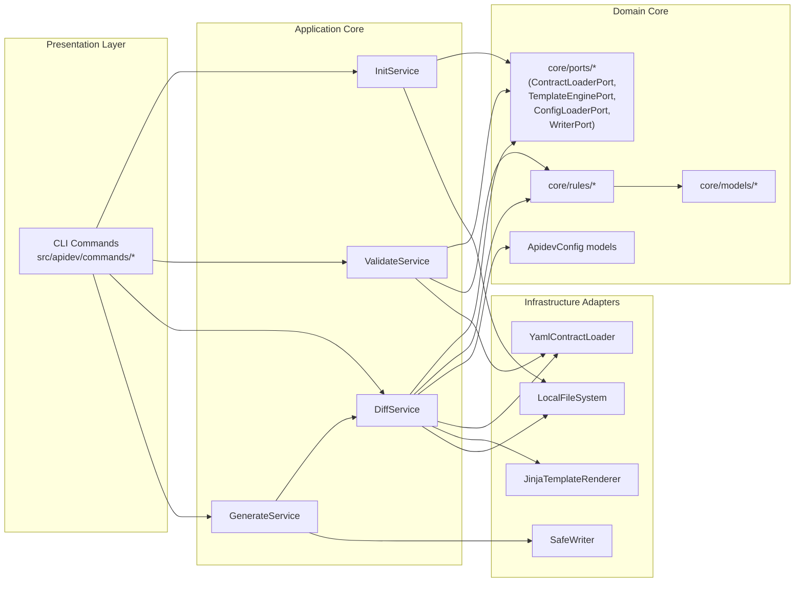

# C4 Level 3: Component View (APIDev Python App)

## Назначение

Показать компоненты внутри APIDev и их зависимостные границы.

## Общая диаграмма компонентов

## Критичные инварианты L3

- `application/*` не импортирует concrete adapters из `infrastructure/*`.
- `core/*` не выполняет direct I/O и не зависит от `commands/application/infrastructure`.
- `commands/*` остаются thin adapters без бизнес-правил.
- `SafeWriter` реализует `WriterPort` и обеспечивает write-boundary только внутри generated root.
