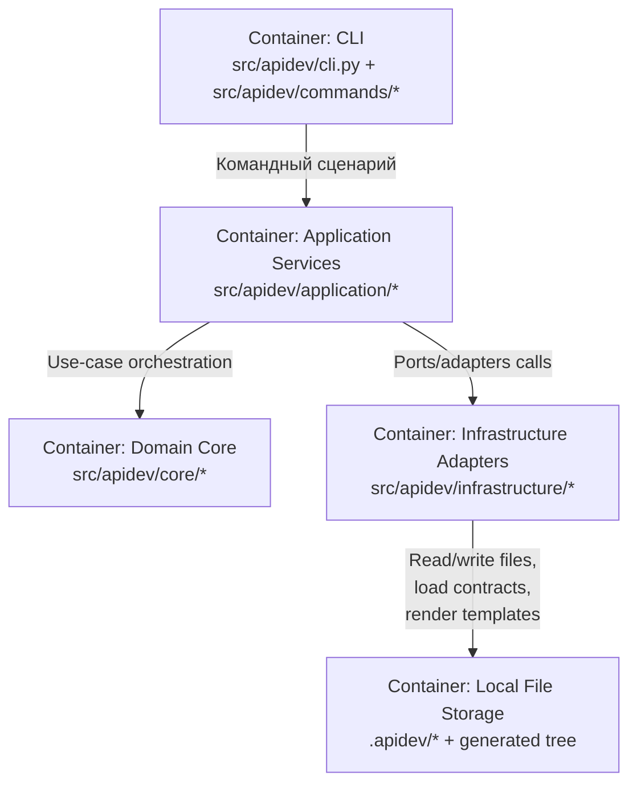

# C4 Level 2: Container View

## Назначение

Описать основные контейнеры/подсистемы APIDev и ключевые потоки между ними.

## Диаграмма контейнеров

## Контейнеры и ответственность

| Контейнер | Ответственность | Ключевые модули |
|---|---|---|
| CLI | Parse/dispatch команд, UX-output | `src/apidev/cli.py`, `src/apidev/commands/*` |
| Application Services | Оркестрация pipeline `load/validate/plan/write` | `src/apidev/application/services/*` |
| Domain Core | Модели, правила, порты | `src/apidev/core/models/*`, `src/apidev/core/rules/*`, `src/apidev/core/ports/*` |
| Infrastructure Adapters | YAML/Jinja/FS/writer реализации | `src/apidev/infrastructure/*` |
| Local File Storage | Хранение контрактов, templates, generated output | `.apidev/*`, target generated dir |

## Главные архитектурные границы

- `core` не зависит от `application`, `commands`, `infrastructure`.
- `application` опирается на порты core и не должен знать concrete adapters.
- Все filesystem side-effects локализованы в infrastructure.

