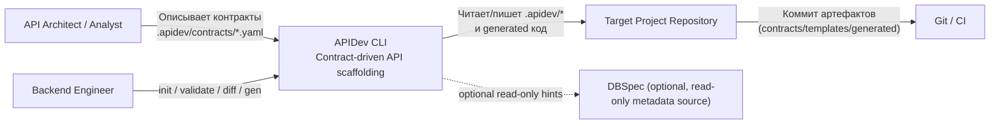

# C4 Level 1: Системный Контекст

## Назначение

Показать границы APIDev, роли пользователей и внешние системы, с которыми инструмент взаимодействует.

## Диаграмма

## Ключевые выводы

- APIDev является локальным CLI-инструментом оркестрации генерации.
- Основные артефакты живут в репозитории целевого проекта.
- Интеграция с DBSpec опциональная и read-only.
- Каноническая команда генерации в документации — `apidev gen`.
