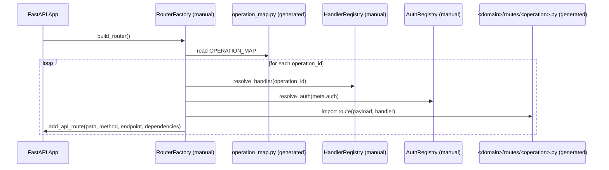
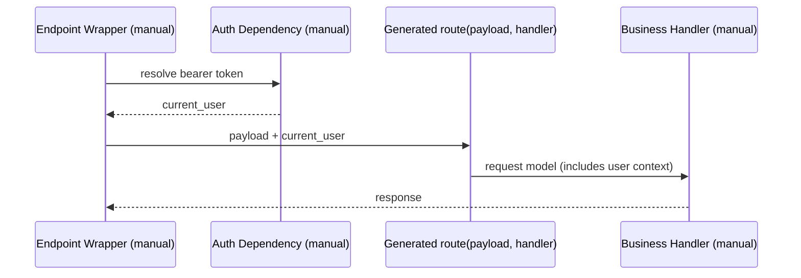

# Интеграция Generated Transport в Target App

Статус: `Authoritative`

Этот документ фиксирует целевой контракт интеграции между generated transport-слоем APIDev и manual-слоем целевого FastAPI-приложения.

## Цель

- обеспечить предсказуемую интеграцию generated кода без смешения ownership;
- явно разделить, что автоматизировано, а что остается ручным;
- зафиксировать стандартные точки связки через registry/factory;
- дать практические примеры endpoint/auth/error/OpenAPI integration.

## Целевая структура generated output

```text
<generated_dir>/
├── operation_map.py
├── openapi_docs.py
└── <domain>/
    ├── __init__.py
    ├── routes/
    │   ├── __init__.py
    │   └── <operation>.py
    └── models/
        ├── __init__.py
        ├── <operation>_request.py
        ├── <operation>_response.py
        └── <operation>_error.py
```

Пример:

```text
.apidev/output/api/
├── operation_map.py
├── openapi_docs.py
└── billing/
    ├── __init__.py
    ├── routes/
    │   ├── __init__.py
    │   └── get_invoice.py
    └── models/
        ├── __init__.py
        ├── get_invoice_request.py
        ├── get_invoice_response.py
        └── get_invoice_error.py
```

## Матрица ответственности

| Область | По умолчанию | Примечание |
|---|---|---|
| Contract-driven transport artifacts (`operation_map`, `openapi_docs`, `routes`, `models`) | Generated | Перегенерируемая зона APIDev |
| Business logic / use-case orchestration | Manual | Реализация handler-ов и доменных сценариев |
| Auth policy и security dependencies | Manual | APIDev использует только контрактный признак `auth` как metadata |
| Error mapping domain -> HTTP contract | Manual | Допускается project-specific policy |
| FastAPI composition root | Manual | Подключение router-ов и wiring окружения |
| Registry/factory glue layer | Manual (может иметь generated skeleton) | Тонкая связка generated/manual слоев |

## Checklist по файлам (Generated vs Manual)

| Файл/паттерн | Ownership | Перезаписывается `apidev gen` | Назначение |
|---|---|---|---|
| `<generated_dir>/operation_map.py` | Generated | Да | Реестр операций и metadata для wiring |
| `<generated_dir>/openapi_docs.py` | Generated | Да | Детерминированный builder OpenAPI `paths` |
| `<generated_dir>/<domain>/__init__.py` | Generated | Да | Package marker для стабильного runtime import |
| `<generated_dir>/<domain>/routes/__init__.py` | Generated | Да | Package marker для routes namespace |
| `<generated_dir>/<domain>/models/__init__.py` | Generated | Да | Package marker для models namespace |
| `<generated_dir>/<domain>/routes/*.py` | Generated | Да | Transport adapter и bridge contract |
| `<generated_dir>/<domain>/models/*.py` | Generated | Да | Request/response/error transport models |
| `<generated_dir>/<scaffold_dir>/handler_registry.py` | Generated scaffold | Только create-if-missing | Каркас маппинга `operation_id -> handler` |
| `<generated_dir>/<scaffold_dir>/router_factory.py` | Generated scaffold | Только create-if-missing | Каркас runtime регистрации endpoint-ов |
| `<generated_dir>/<scaffold_dir>/auth_registry.py` | Generated scaffold | Только create-if-missing | Каркас резолва auth dependencies |
| `<generated_dir>/<scaffold_dir>/error_mapper.py` | Generated scaffold | Только create-if-missing | Каркас domain->HTTP error mapping |
| `app/**/handlers*.py` | Manual | Нет | Бизнес-логика use-case/домен |
| `app/**/auth*.py` | Manual | Нет | Декод токена, policy, user context |
| `app/**/factory*.py` или `app/**/composition*.py` | Manual | Нет | Финальное wiring в FastAPI runtime |

## Интеграционная модель (registry + factory)

Канонический (целевой) путь интеграции в этом проекте — **один**:

- регистрация endpoint-ов через generated registry (`operation_map.py`) и manual `RouterFactory`;
- без ручного дублирования `path/method` через отдельные `@router.get/@router.post` для каждой операции.

Ручная регистрация каждого endpoint через декораторы допустима только как временный переходный fallback и не является целевым контрактом.

### Компоненты

- `operation_map.py` (generated): реестр операций и metadata для wiring.
- `HandlerRegistry` (manual): маппинг `operation_id -> handler implementation`.
- `AuthRegistry` (manual): маппинг `auth type -> dependency/provider`.
- `ErrorMapper` (manual): маппинг исключений в контрактные HTTP-ошибки.
- `RouterFactory` (manual): сборка FastAPI endpoint-ов на основе generated metadata.

### Package/import policy (single-level domain layout)

- references в `operation_map.py` строятся как module paths относительно `generated_root` (`<domain>.routes.*`, `<domain>.models.*`);
- generated router использует относительные импорты вида `from ..models.<operation>_request import ...`;
- generator всегда создает `__init__.py` в `<domain>/`, `<domain>/routes/`, `<domain>/models/`;
- runtime wiring должен импортировать модули только через metadata из `operation_map.py`, без ручного дописывания domain-specific путей.

### Поток регистрации endpoint-ов



## Пример: подключение endpoint

```python
from fastapi import APIRouter, Depends

from generated_api.operation_map import OPERATION_MAP
from app.integration.handlers import HANDLERS
from app.integration.auth import resolve_auth_dependency
from app.integration.runtime import import_callable


def build_generated_router() -> APIRouter:
    router = APIRouter()

    for operation_id in sorted(OPERATION_MAP):
        meta = OPERATION_MAP[operation_id]
        route_callable = import_callable(meta["bridge"]["callable"])
        handler = HANDLERS[operation_id]
        auth_dependency = resolve_auth_dependency(meta.get("auth", "public"))

        async def endpoint(payload: dict[str, object], _route=route_callable, _handler=handler):
            return await _route(payload=payload, handler=_handler)

        dependencies = []
        if auth_dependency is not None:
            dependencies = [Depends(auth_dependency)]

        router.add_api_route(
            path=str(meta["path"]),
            endpoint=endpoint,
            methods=[str(meta["method"]).upper()],
            name=operation_id,
            dependencies=dependencies,
        )

    return router
```

Этот пример является каноническим target-подходом для runtime wiring.

## Пример: обработка ошибок

```python
from fastapi import HTTPException


class DomainErrorMapper:
    def to_http(self, operation_id: str, exc: Exception) -> HTTPException:
        if exc.__class__.__name__ == "InvoiceNotFoundError":
            return HTTPException(
                status_code=404,
                detail={"code": "INVOICE_NOT_FOUND", "message": "Invoice not found"},
            )
        return HTTPException(
            status_code=500,
            detail={"code": "INTERNAL_ERROR", "message": "Unexpected error"},
        )
```

Рекомендуемый паттерн:
- error mapping централизуется в одном manual компоненте;
- endpoint-обертки используют единый mapper, чтобы избежать дублирования.

## Пример: подключение аутентификации

```python
from collections.abc import Awaitable, Callable
from typing import Any


def resolve_auth_dependency(auth_type: str) -> Callable[..., Awaitable[Any]] | None:
    if auth_type == "public":
        return None
    if auth_type == "bearer":
        return require_bearer_user
    raise ValueError(f"Unsupported auth type: {auth_type}")
```

Рекомендуемый паттерн:
- generated metadata определяет только тип auth (`public`/`bearer`);
- конкретная security-политика и проверка прав остаются manual.

## Контракт передачи `current_user` в бизнес-логику

### Где выполняется расшифровка токена

Расшифровка/проверка токена выполняется в manual auth dependency (например, `require_bearer_user`), а не в generated transport-слое.

### Как `current_user` попадает в handler

Канонический поток:

1. FastAPI endpoint (manual composition layer) вызывает auth dependency.
2. Dependency валидирует токен и возвращает domain/user context (`current_user`).
3. Endpoint формирует payload для generated route и добавляет `current_user` (или `current_user_id`) в payload/context.
4. Generated route передает payload в manual handler bridge.
5. Manual business handler получает user context через request model и применяет бизнес-правила.



### Минимальный пример передачи user context

```python
@router.get("/v1/invoices/{invoice_id}")
async def endpoint(invoice_id: str, current_user=Depends(require_bearer_user)):
    payload = {
        "invoice_id": invoice_id,
        "current_user_id": current_user.id,
    }
    return await generated_route(payload=payload, handler=business_handler)
```

Ограничение:
- Generated слой не должен декодировать токен и не должен содержать проектно-специфичную auth policy.

## Пример: OpenAPI integration

```python
from fastapi.openapi.utils import get_openapi

from generated_api.openapi_docs import build_openapi_paths


def install_custom_openapi(app) -> None:
    def custom_openapi() -> dict[str, object]:
        schema = get_openapi(
            title=app.title,
            version=app.version,
            routes=app.routes,
        )
        schema["paths"] = build_openapi_paths()
        return schema

    app.openapi = custom_openapi
```

## Что может быть дополнительно сгенерировано

Следующие элементы могут быть добавлены как generated skeletons без переноса ownership бизнес-логики:

- шаблон `HandlerRegistry` с TODO-местами для реализаций;
- шаблон `RouterFactory` (интеграционный каркас);
- шаблон `ErrorMapper` с базовым fallback;
- шаблон `AuthRegistry` для `public`/`bearer`.

### Политика генерации scaffold-файлов

Канонический контракт:

- `apidev init` добавляет в `.apidev/config.toml` параметры:
  - `generator.scaffold = true`
  - `generator.scaffold_dir = "integration"`
- CLI overrides:
  - `--scaffold` (включить scaffold-генерацию для запуска)
  - `--no-scaffold` (выключить scaffold-генерацию для запуска)
- Приоритет источников: CLI flag -> config -> default.
- Политика записи фиксированная: `create-if-missing`:
  - если scaffold-файл отсутствует, он создается;
  - если scaffold-файл существует, он не перезаписывается.
- `generator.scaffold_dir` трактуется как относительный путь от `generator.generated_dir`.
- Абсолютные пути для `generator.scaffold_dir` запрещены.
- `generator.scaffold_dir` не может выходить за пределы `generator.generated_dir`.

Минимальный набор scaffold-файлов при opt-in:

```text
<generated_dir>/integration/
├── handler_registry.py
├── router_factory.py
├── auth_registry.py
└── error_mapper.py
```

Назначение:

- ускорить первичную интеграцию target app;
- сохранить manual ownership уже созданного интеграционного кода;
- исключить риск случайной перезаписи кастомной бизнес/безопасностной логики.

## Ограничения

- APIDev не должен генерировать use-case/business логику.
- APIDev не должен генерировать project-specific auth policy.
- APIDev не должен генерировать domain-specific error semantics.
- Запись разрешена только внутри configured generated root.

## Нецелевой путь (anti-pattern)

- Поддерживать отдельный ручной `@router.<method>(path)` на каждую контрактную операцию как основной способ интеграции.
- Дублировать `path/method` одновременно в контракте и в ручном endpoint-объявлении.

Причина:
- это ломает single source of truth и повышает риск дрейфа между контрактом и runtime wiring.

## Связанные документы

- `docs/reference/contract-format.md`
- `docs/reference/cli-contract.md`
- `docs/architecture/architecture-overview.md`
- `docs/architecture/architecture-rules.md`
- `docs/process/testing-strategy.md`
