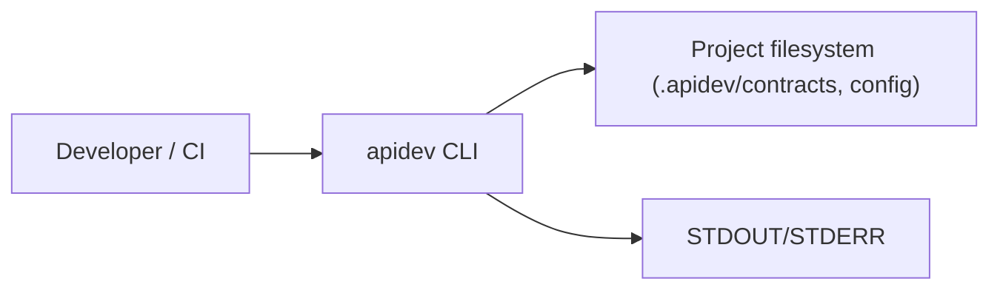
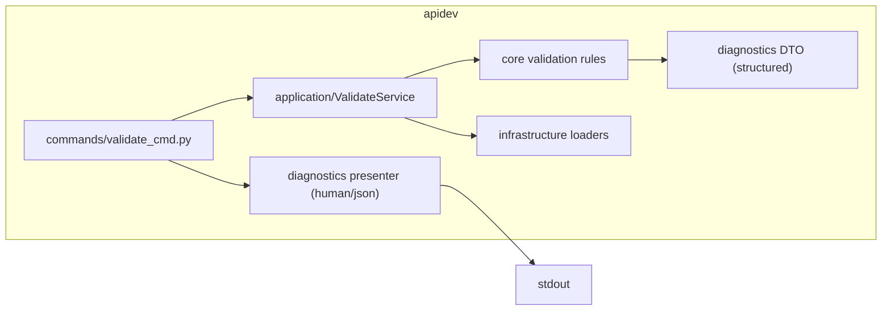
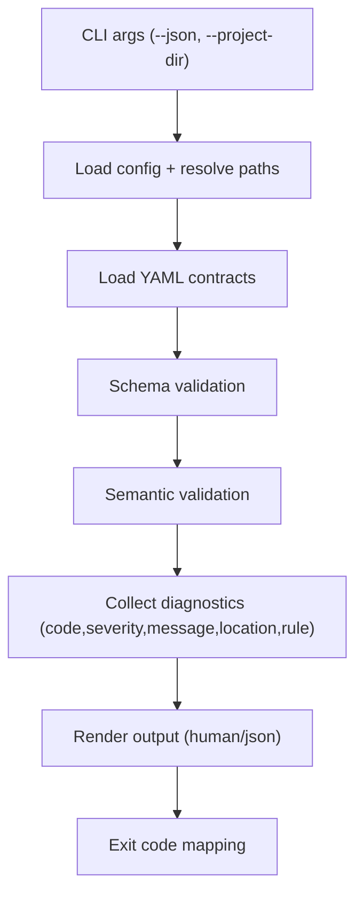

# Архитектура: Contract Validation Hardening

## Baseline и целевое изменение
Текущий validate-пайплайн использует строковые ошибки и ограниченный набор проверок.
Целевое состояние этапа A: формальный schema + semantic pipeline со структурированной диагностикой и dual output (human/json).

## C4 Level 1: System Context

## C4 Level 2: Container

## C4 Level 3: Component (Validate Flow)

## Архитектурные инварианты
- `commands` остаются thin-адаптером CLI без business-правил.
- `application/core` владеют validation logic и формированием diagnostics.
- Infrastructure отвечает за чтение источников, не за policy.
- Оба формата вывода строятся из одного diagnostics контракта.
