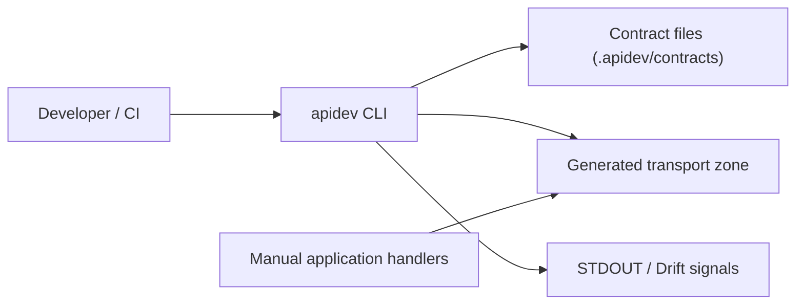
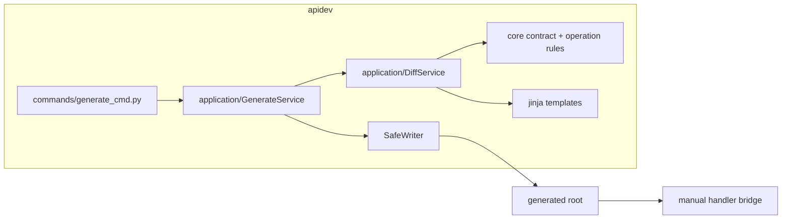
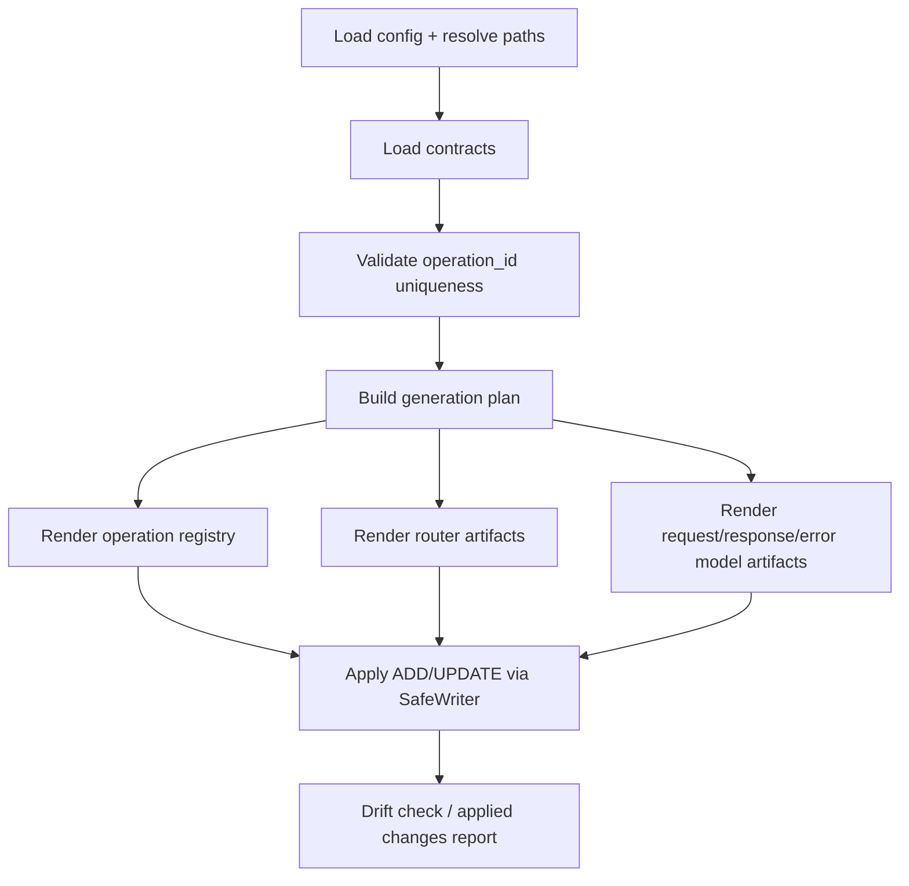

# Архитектура: Transport Generation MVP+

## Baseline и целевое изменение
Baseline generation-пайплайн формирует operation map и router skeleton-файлы.
Целевое состояние этапа B: расширенный deterministic transport generation с model artifacts, runnable wiring и стабильным bridge/registry contract.

## C4 Level 1: System Context

## C4 Level 2: Container

## C4 Level 3: Component (Transport Generation Flow)

## Архитектурные инварианты
- CLI остается thin orchestration-слоем без бизнес-логики.
- Planning/rendering выполняется в application/core, а не в infrastructure writer.
- Запись остается ограниченной generated root.
- Generated transport слой не владеет domain/service implementation и взаимодействует с manual кодом только через bridge contract.
