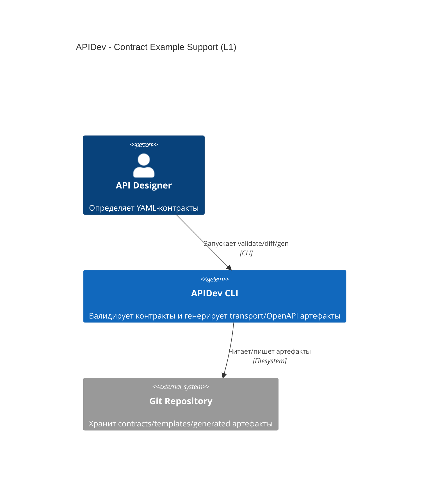
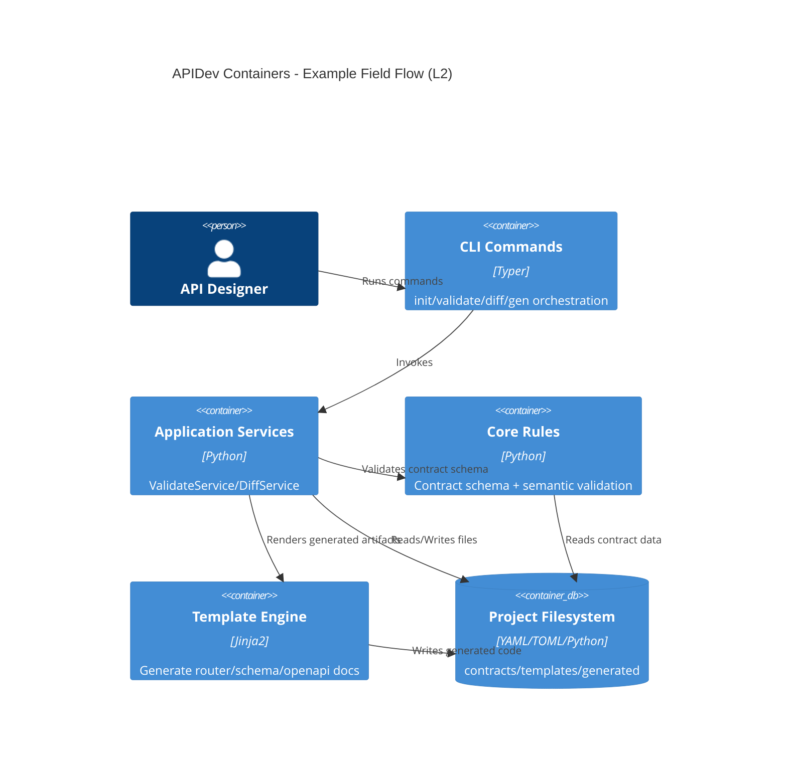
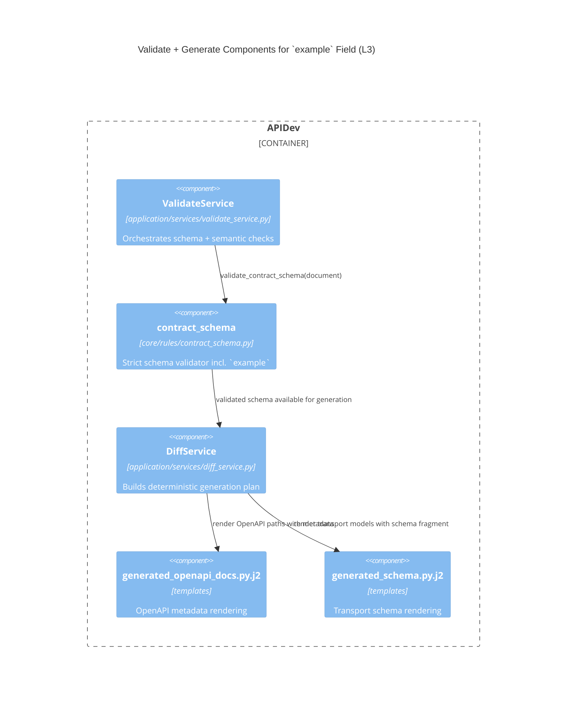

# 01. Architecture

## System Context (C4 Level 1)

## Container View (C4 Level 2)

## Component View (C4 Level 3)

## Boundary Rules
- Generated code remains transport-only; business logic не генерируется.
- Unknown-field policy сохраняется strict, кроме явно разрешенного `example`.
- Output remains deterministic for identical contract inputs.
