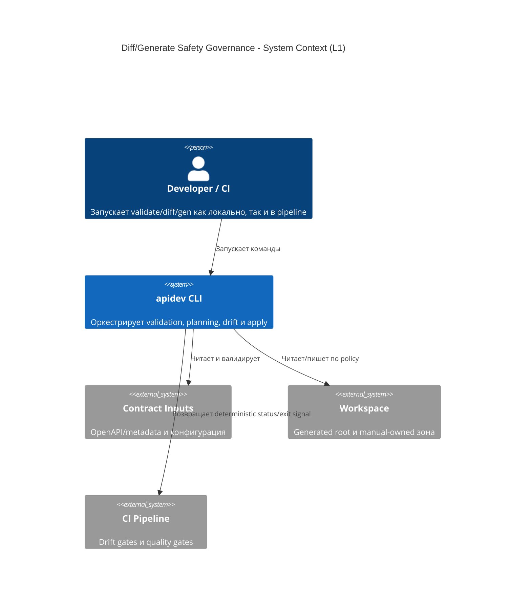
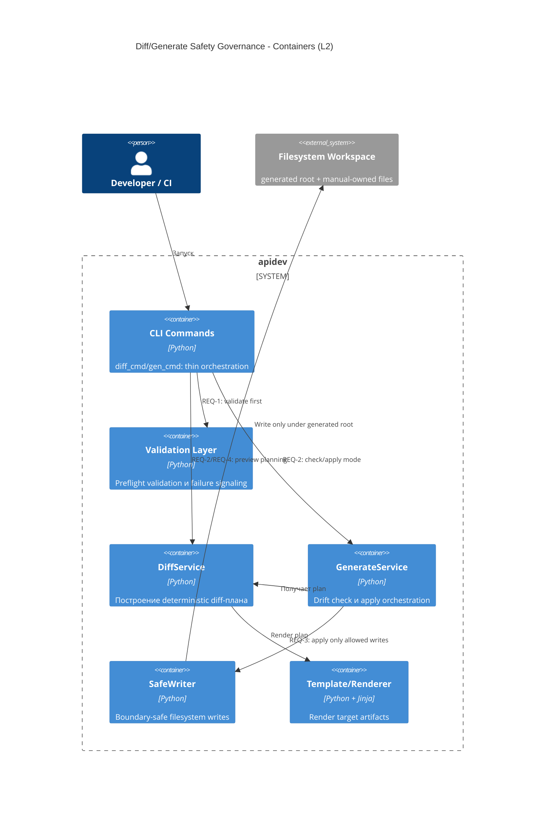
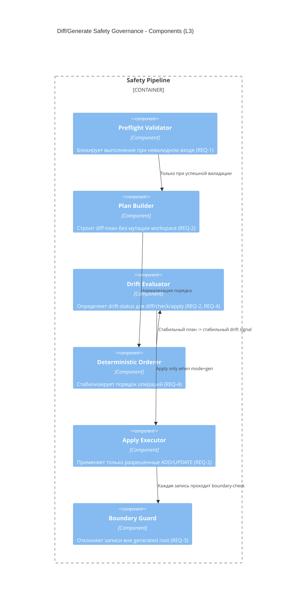

# Архитектура: Diff/Generate Safety & Drift Governance

## Baseline и целевое изменение

Baseline уже содержит preflight validation, diff/check режимы и write-boundary в `SafeWriter`.  
Целевое изменение: формализовать это как capability-контракт с явной трассировкой на `REQ-1..REQ-4`.

## C4 Level 1: System Context

## C4 Level 2: Container

## C4 Level 3: Component (Safety Pipeline)

## Архитектурные инварианты

- `REQ-1`: validation всегда предшествует diff/apply шагам.
- `REQ-2`: `diff` и `gen --check` не инициируют filesystem writes.
- `REQ-3`: `SafeWriter` является единой точкой записи и enforcing write-boundary.
- `REQ-4`: порядок и состав diff-плана детерминированы для неизменных входов.

## Assumptions

- Все записи в generated artifacts идут только через `SafeWriter`.
- Типы операций `ADD/UPDATE/SAME` остаются базовой моделью изменений.
- Канонизация контрактной metadata достаточна для стабильного fingerprint.

## Unresolved Questions

- Нужен ли отдельный компонент для нормализации failure-code semantics между `diff` и `gen`.
- Следует ли формально выделить read-only filesystem adapter для `diff`/`check` для упрощения доказательства non-mutation.
- Нужна ли явная архитектурная граница между drift-evaluation и console-reporting.
