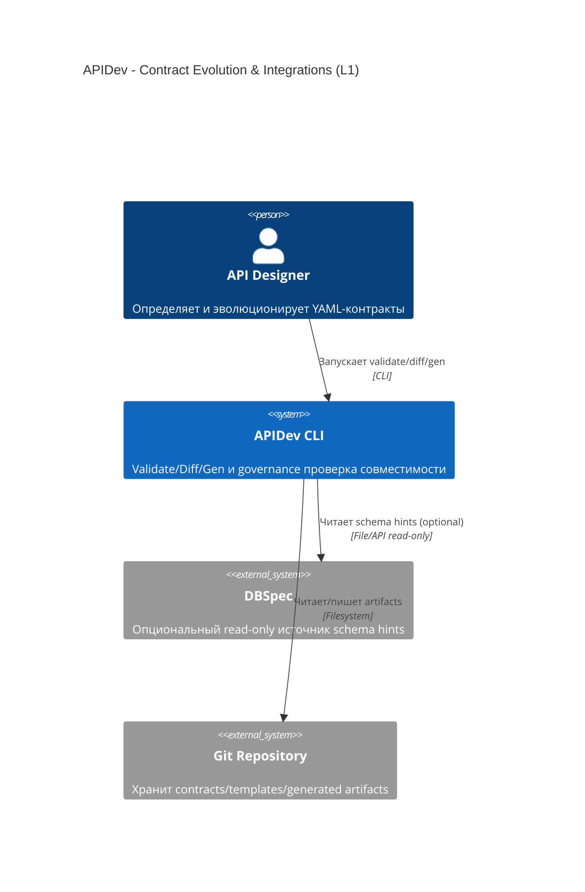
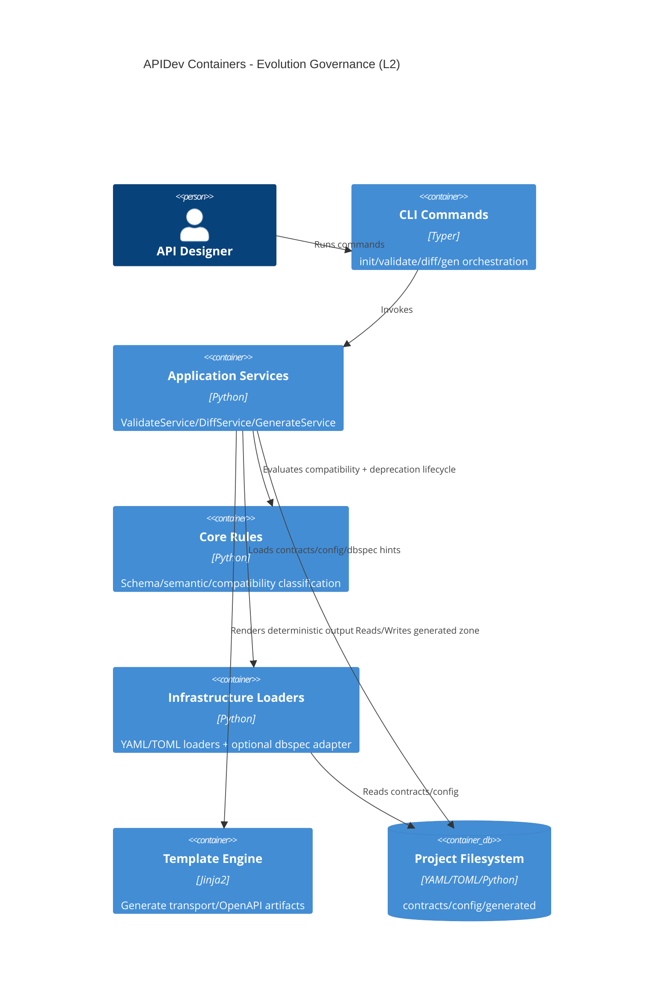
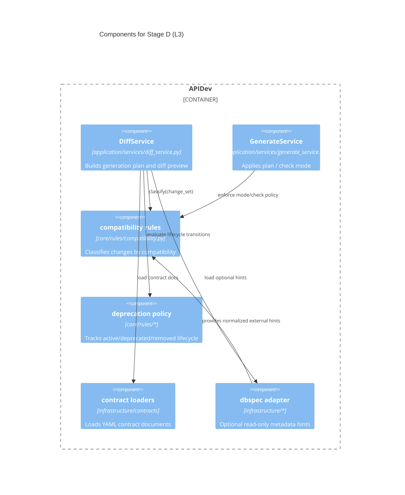

# 01. Architecture

## System Context (C4 Level 1)

## Container View (C4 Level 2)

## Component View (C4 Level 3)

## Boundary Rules
- APIDev не становится владельцем DB schema artifacts; интеграция с `dbspec` только read-only.
- Отсутствие `dbspec` не ломает основной workflow `validate/diff/gen`.
- Compatibility/deprecation решения остаются deterministic и test-backed.
