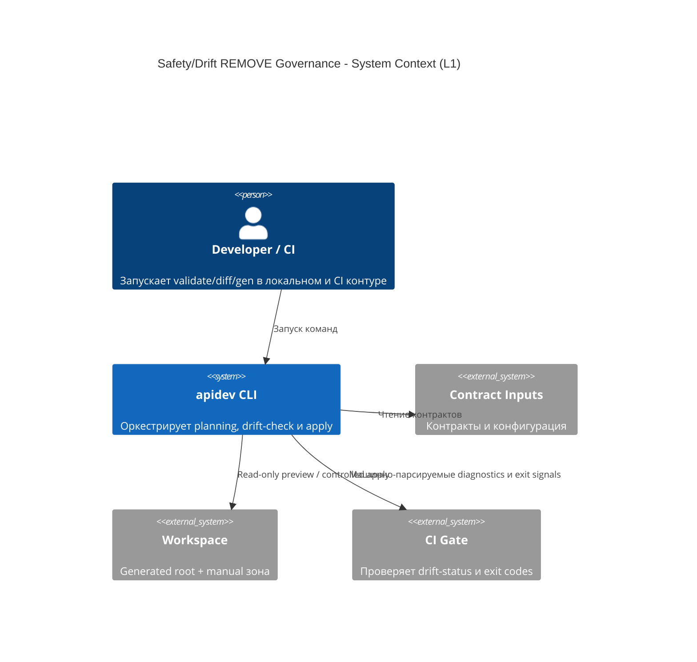
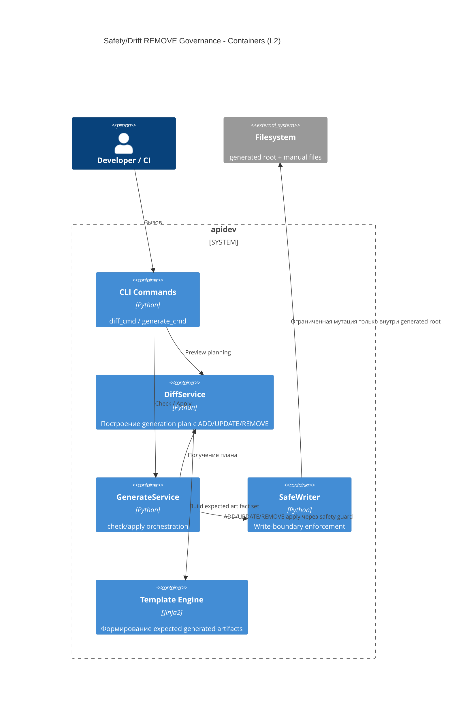
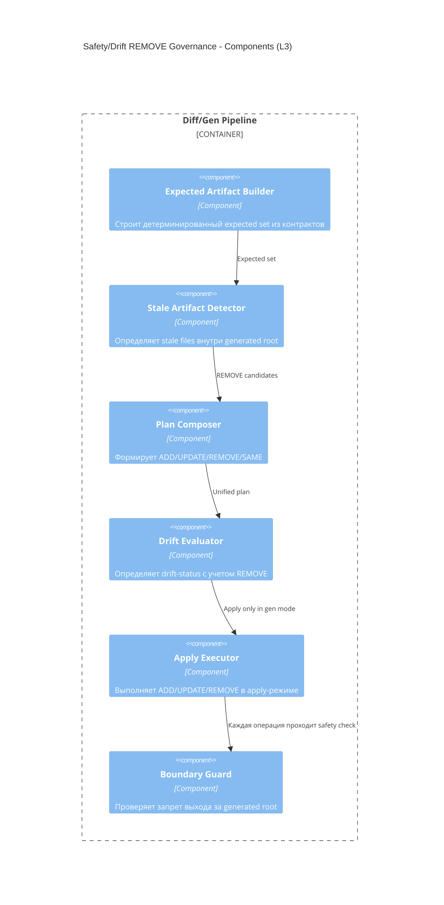

# Архитектура: Safety/Drift Completion (REMOVE)

## Baseline и целевое изменение
Текущий pipeline детектирует drift по `ADD/UPDATE`. Целевое изменение добавляет `REMOVE` как first-class операцию в plan/build/check/apply цепочке без нарушения write-boundary.

## C4 Level 1: System Context

## C4 Level 2: Container

## C4 Level 3: Component

## Архитектурные инварианты
- Все `REMOVE` вычисляются только относительно generated root.
- `diff` и `gen --check` не выполняют файловых мутаций.
- Apply для `REMOVE` использует те же safety-check принципы, что и запись.
- Порядок операций в плане стабилен при неизменных входах.
