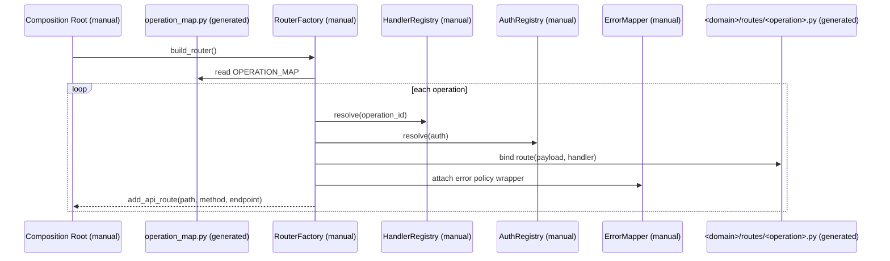

# Integration Contract: Generated Transport + Manual App Layer

## Цель
Зафиксировать целевой способ интеграции generated артефактов APIDev в runtime target приложения без переноса ownership бизнес-логики в generated-зону.

## Ownership
- Generated: transport metadata, route adapters, model artifacts, OpenAPI builder.
- Manual: business handlers, auth dependencies/policy, error mapping policy, application composition root.

## Binding Pattern
- Registry (`operation_map.py`) предоставляет operation metadata.
- Factory (manual) регистрирует FastAPI endpoints и связывает metadata с ручными handler/auth/error компонентами.

## Integration Sequence

## OpenAPI Contract
- `openapi_docs.py` детерминированно строит `paths` фрагмент из generated registry.
- Composition root target app решает, как объединять этот фрагмент с runtime OpenAPI schema.

## Негативные границы
- Generated layer не реализует business handlers.
- Generated layer не реализует project-specific auth policy.
- Generated layer не реализует domain-specific error semantics.
