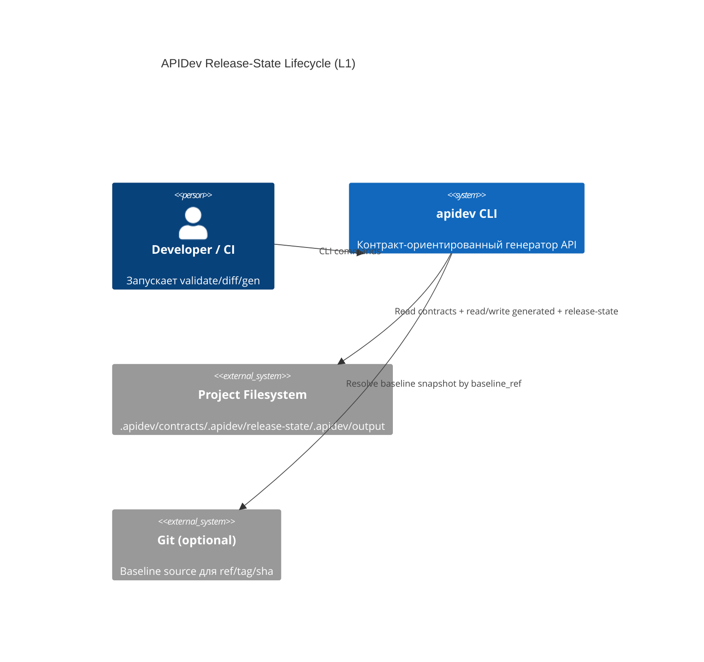
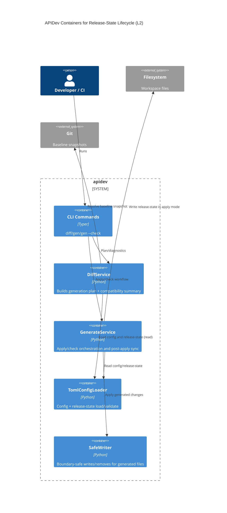
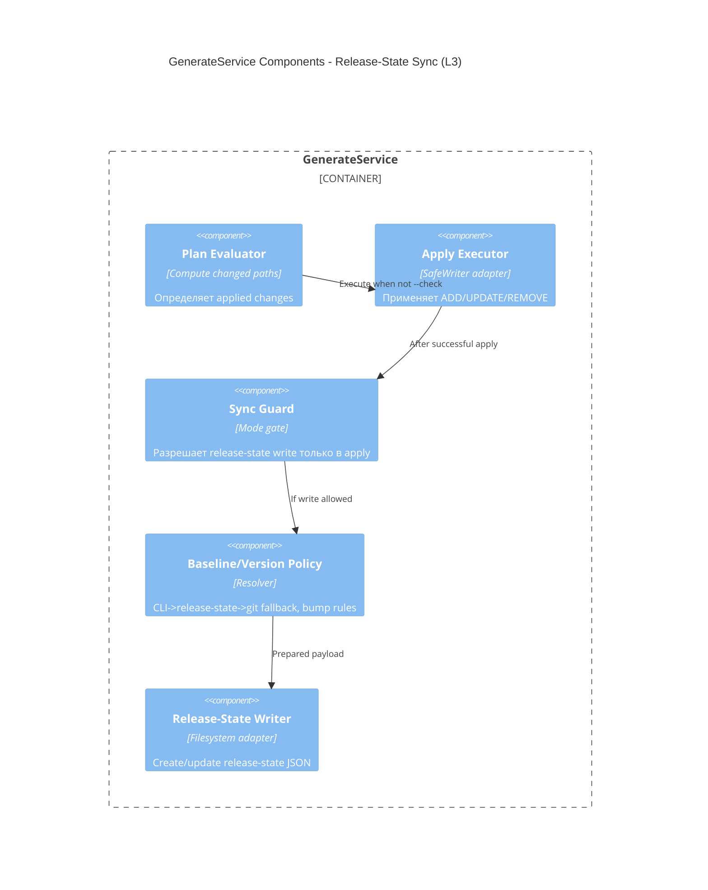

# Архитектура: Auto release-state lifecycle в `apidev gen`

## Контекст
Цель — формализовать write lifecycle release-state только для `gen apply`, сохранив strict read-only поведение для `diff` и `gen --check`.

## C4 Level 1: System Context

## C4 Level 2: Container

## C4 Level 3: Component

## Архитектурные инварианты
- `diff` и `gen --check` не модифицируют release-state.
- `gen apply` может писать release-state только после успешного apply-пайплайна.
- baseline compare контракт в `DiffService` сохраняет приоритет `CLI -> release-state`.
