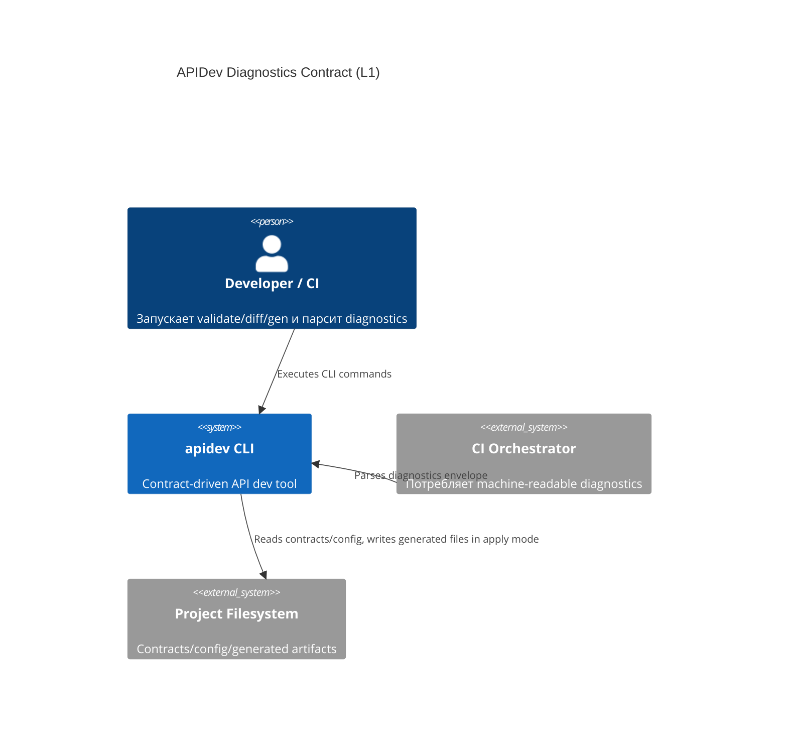
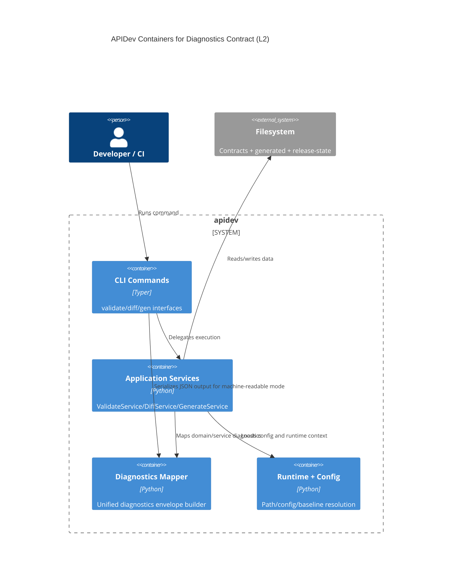
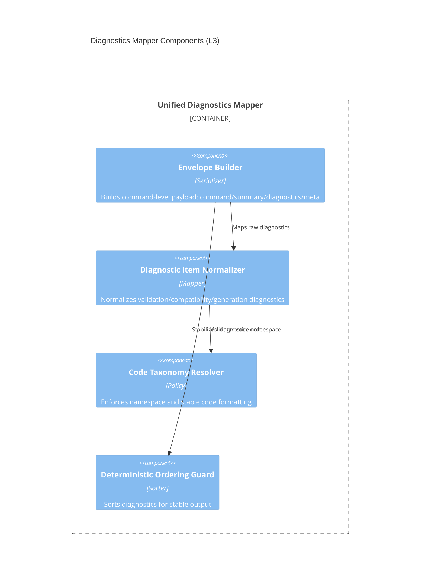

# Архитектура: Unified Diagnostics Contract

## Контекст
Цель — добавить единый machine-readable diagnostics contract для CLI команд без изменения базовых drift/policy семантик.

## C4 Level 1: System Context

## C4 Level 2: Container

## C4 Level 3: Component

## Архитектурные инварианты
- JSON diagnostics contract должен быть единым для `validate|diff|gen --check|gen`.
- Plain-text UX остается поддерживаемым по умолчанию.
- Drift/policy semantics не меняются в рамках hardening diagnostics.
- Вывод diagnostics детерминирован для одинакового входа.
