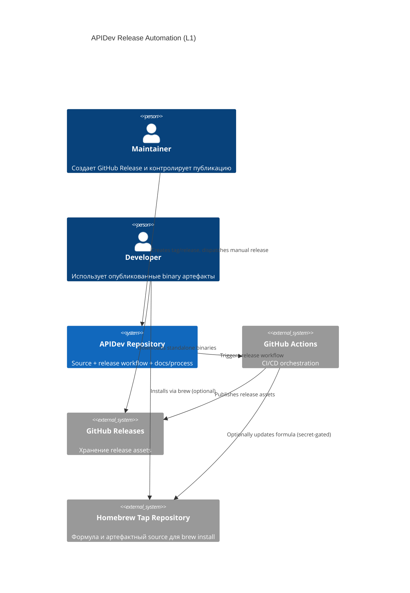
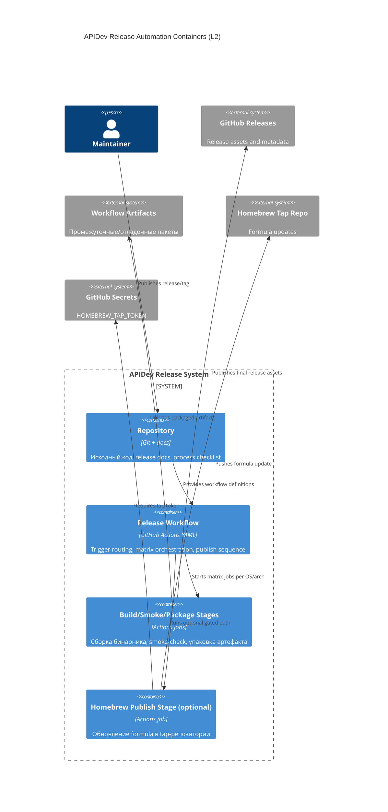
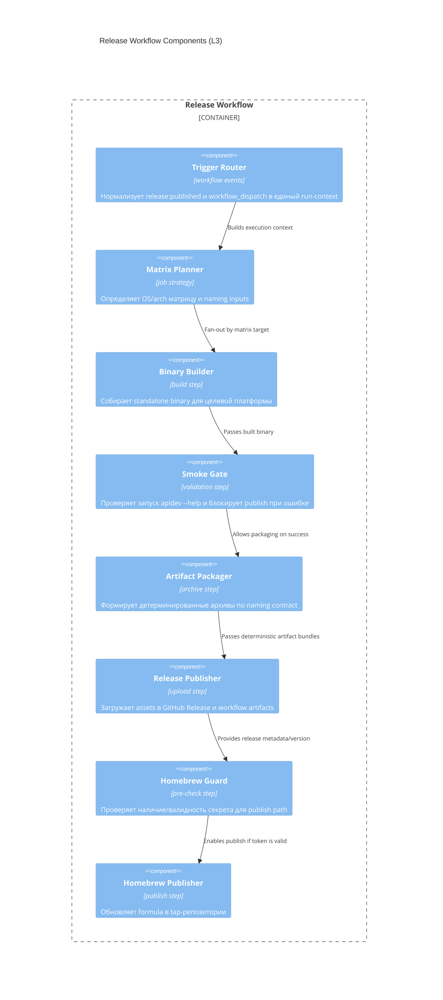

# Архитектура: Release Automation for Multi-OS Binary Delivery

## Контекст
`apidev` должен получить репозиторный release pipeline для публикации standalone binary под `macOS`, `Windows`, `Linux` с обязательными quality gates и управляемым optional Homebrew path.

## Scope архитектуры
- Входит: GitHub Actions workflow, matrix build/smoke/package, release asset upload, optional Homebrew publish.
- Не входит: изменение runtime-логики CLI команд и доменной бизнес-логики.

## C4 Level 1: System Context

## C4 Level 2: Container

## C4 Level 3: Component

## Архитектурные инварианты
- Публикация release assets запрещена при провале smoke-check в любой обязательной ветке матрицы.
- Именование артефактов должно быть детерминированным и воспроизводимым из version + target (`os`, `arch`).
- Optional Homebrew path изолирован от базового multi-OS publish и не должен создавать partial release assets.
- Документация Distribution/Release process должна отражать фактический pipeline contract.

## Assumptions
- GitHub Releases является единственным source of truth для binary дистрибуции первой итерации.
- Сборка standalone binary для `apidev` реализуема в CI без внешней ручной сборки.
- Runner matrix `macOS|Windows|Linux` покрывает целевую аудиторию текущего этапа Horizon 2.

## Risks
- Различия toolchain/packaging между ОС могут вызвать platform-specific flaky failures.
- Длительность matrix pipeline может увеличиться и снизить throughput release-процесса.
- Ошибки в naming/version extraction способны привести к mismatch между тегом и asset именами.

## Open Questions
- Нужна ли поддержка нескольких архитектур (`amd64` + `arm64`) во всех ОС в первой итерации?
- Нужна ли автоматическая подпись/checksum verification как обязательный gate первой итерации?

## Resolved Decisions for Implement
- `workflow_dispatch` MUST принимать явный `release_version` input; pipeline SHALL падать при отсутствии/пустом значении, чтобы исключить недетерминированный version source.
- Homebrew publish path фиксируется как isolated non-blocking path относительно core assets: при pre-check failure job завершаетcя controlled failure и не откатывает уже консистентно опубликованные GitHub Release assets.
