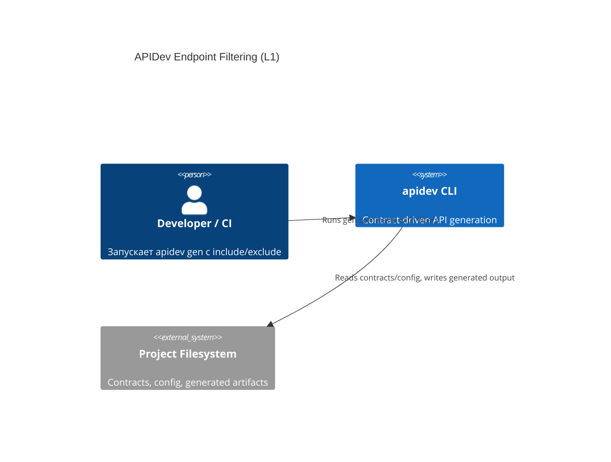
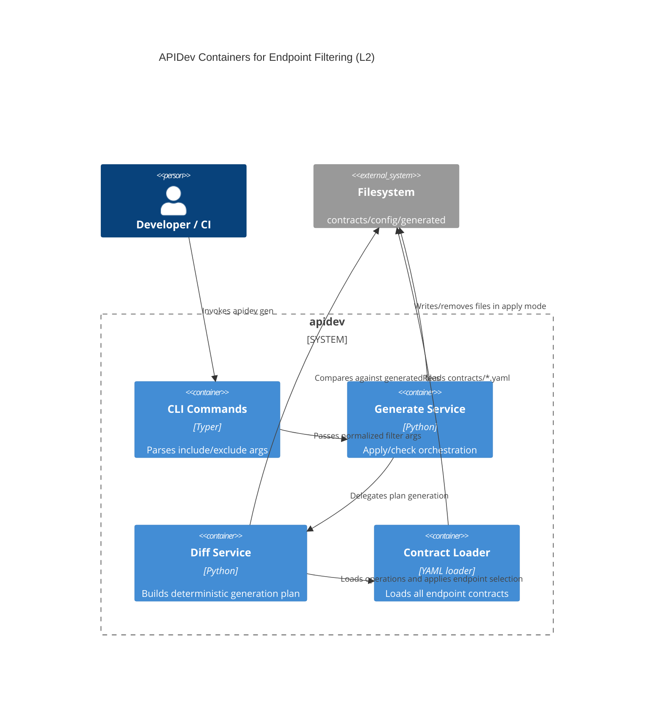
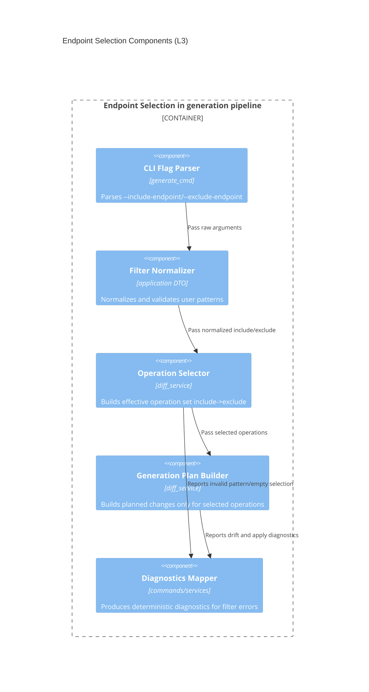

# Архитектура: Endpoint Include/Exclude для `apidev gen`

## Контекст
Требуется добавить фильтрацию endpoint-ов в generation pipeline без изменения структуры контрактов и без нарушения deterministic generation.

## C4 Level 1: System Context

## C4 Level 2: Container

## C4 Level 3: Component

## Архитектурные инварианты
- Фильтрация применяется до построения generation plan.
- Без include/exclude флагов поведение `apidev gen` остается полностью совместимым.
- Порядок операций после фильтрации остается детерминированным.
- Safety boundaries для write/remove сохраняются без ослабления.
