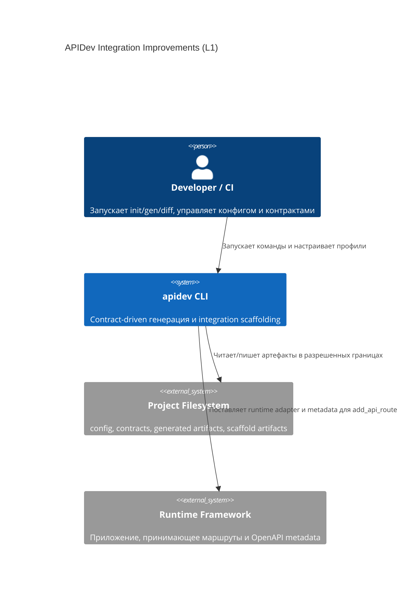
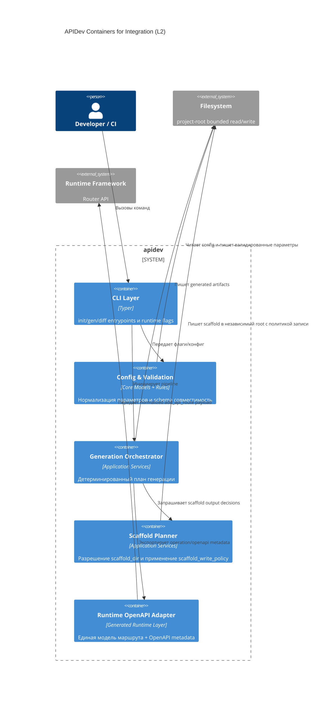
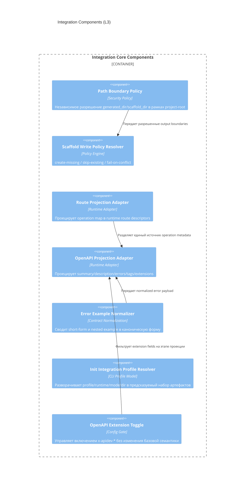

# Архитектура: Integration Improvements (`012-integration`)

## Контекст
Нужно расширить integration-контур `apidev` без нарушения:
- безопасных границ записи в файловую систему;
- детерминированности генерации и диагностики;
- стабильности существующих сценариев без новых опций.

## Архитектурные цели
- Развязать `scaffold_dir` и `generated_dir` как независимые output-контуры.
- Сделать запись scaffold явной и управляемой политикой.
- Синхронизировать runtime routing и OpenAPI metadata через единый адаптер.
- Ввести конфигурируемость OpenAPI extensions без изменения core-контракта.

## C4 Level 1: System Context

## C4 Level 2: Container

## C4 Level 3: Component

## Архитектурные инварианты
- Любая запись остается в пределах `project-root`; выход за границы и неоднозначные пути запрещены.
- `scaffold_dir` независим от `generated_dir` логически, но подчиняется тем же security boundary правилам.
- Порядок обработки операций стабилен и не зависит от окружения запуска.
- Runtime route metadata и OpenAPI metadata получают данные из единой нормализованной модели.
- Домен endpoint-а определяется из domain layout операции; Swagger tags являются производным представлением, а не отдельным источником истины.
- Отключение OpenAPI extensions влияет только на `x-apidev-*` поля и не меняет core OpenAPI семантику.
