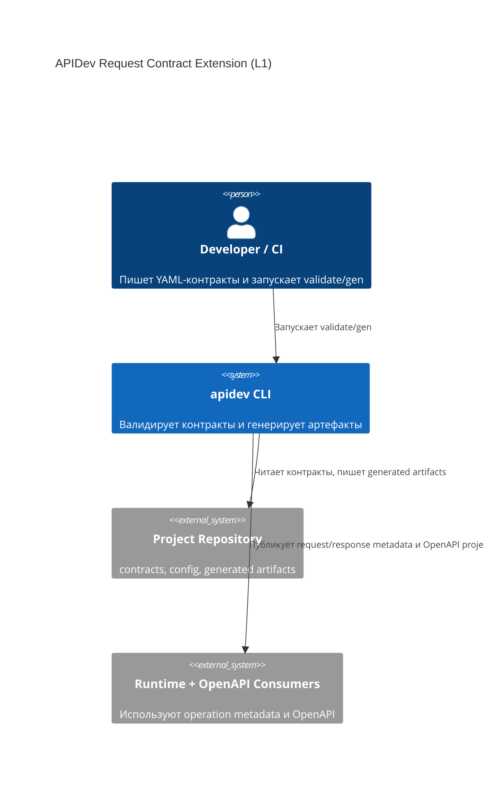
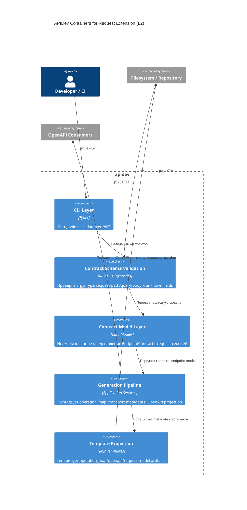
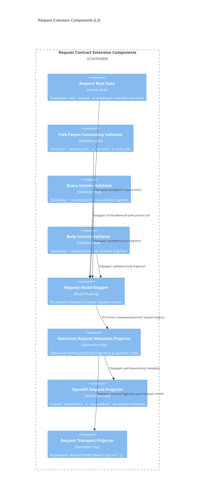

# Архитектура: Request Contract Extension (`013-extend-contract`)

## Контекст
Baseline показал, что текущая модель контракта покрывает `response` и `errors`, но не содержит нормативного root-блока `request`. Из-за этого request-часть transport/OpenAPI не генерируется детерминированно и остается эвристической/пустой.

## Архитектурные цели
- Добавить в контракт явный schema-driven слой request-модели.
- Сохранить strict schema validation и fail-fast diagnostics.
- Синхронизировать request-представление между validation, operation metadata и OpenAPI projection.
- Сохранить детерминированность генерации при одинаковом входе.

## C4 Level 1: System Context

## C4 Level 2: Container

## C4 Level 3: Component

## Архитектурные инварианты
- `request` обрабатывается как нормативная часть root-контракта.
- Unknown fields в `request` и его подблоках запрещены.
- `request.path` должен быть строго согласован с route path placeholders.
- `request.query` и `request.body` опциональны, но при наличии обязаны быть валидными schema fragments.
- `operation_map` становится единой точкой request metadata для downstream проекций.
- OpenAPI `parameters`/`requestBody` строятся только из контрактной request-модели, без эвристик.
- Генерация и диагностика остаются детерминированными.
