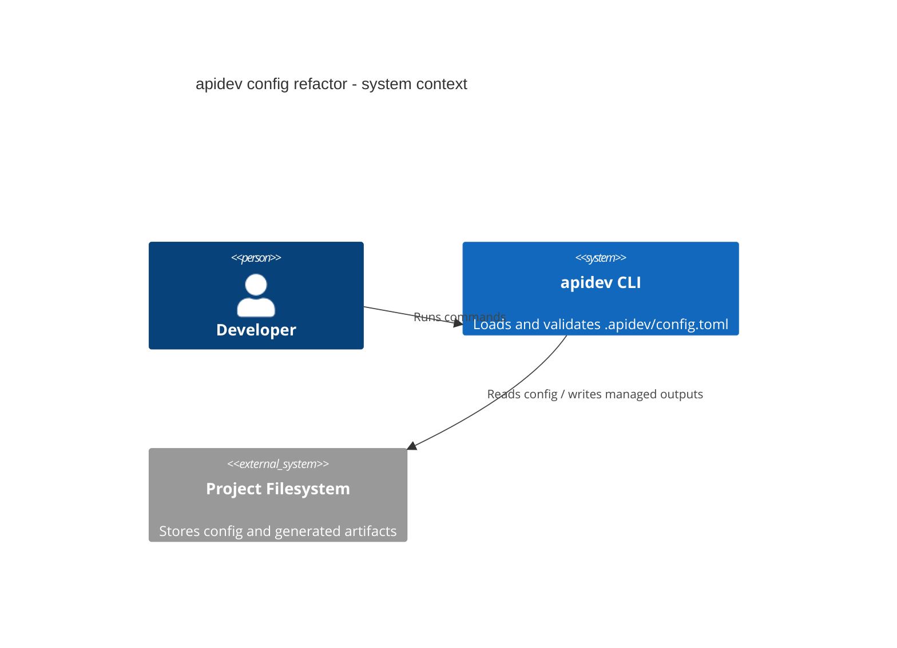
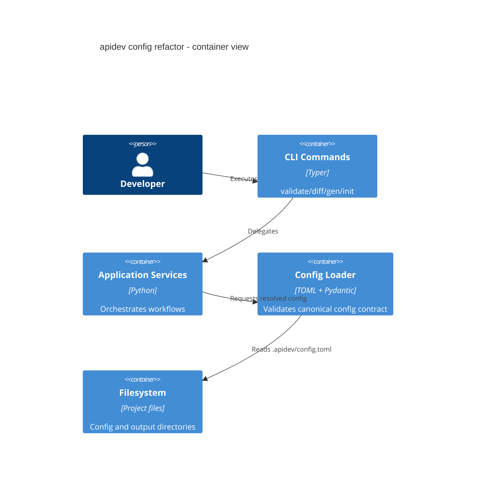
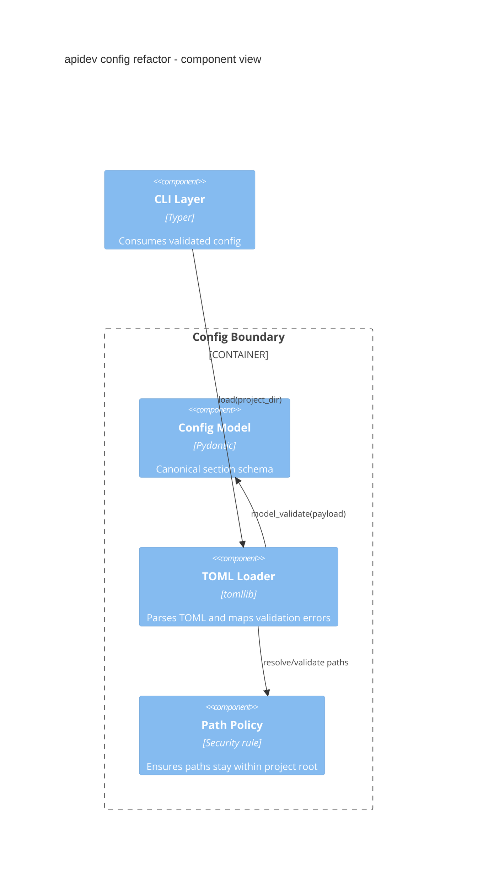

# Architecture

## Level 1: System Context

```mermaid
C4Context
  title apidev config refactor - system context
  Person(dev, "Developer")
  System(cli, "apidev CLI", "Loads and validates .apidev/config.toml")
  System_Ext(fs, "Project Filesystem", "Stores config and generated artifacts")
  Rel(dev, cli, "Runs commands")
  Rel(cli, fs, "Reads config / writes managed outputs")
```

## Level 2: Container

```mermaid
C4Container
  title apidev config refactor - container view
  Person(dev, "Developer")
  Container(cli, "CLI Commands", "Typer", "validate/diff/gen/init")
  Container(app, "Application Services", "Python", "Orchestrates workflows")
  Container(cfg, "Config Loader", "TOML + Pydantic", "Validates canonical config contract")
  Container(fs, "Filesystem", "Project files", "Config and output directories")
  Rel(dev, cli, "Executes")
  Rel(cli, app, "Delegates")
  Rel(app, cfg, "Requests resolved config")
  Rel(cfg, fs, "Reads .apidev/config.toml")
```

## Level 3: Component

```mermaid
C4Component
  title apidev config refactor - component view
  Container_Boundary(cfgb, "Config Boundary") {
    Component(model, "Config Model", "Pydantic", "Canonical section schema")
    Component(loader, "TOML Loader", "tomllib", "Parses TOML and maps validation errors")
    Component(path_policy, "Path Policy", "Security rule", "Ensures paths stay within project root")
  }
  Component(cli, "CLI Layer", "Typer", "Consumes validated config")
  Rel(cli, loader, "load(project_dir)")
  Rel(loader, model, "model_validate(payload)")
  Rel(loader, path_policy, "resolve/validate paths")
```
