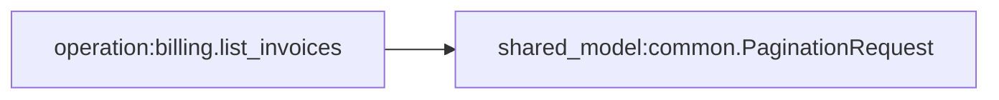

## Контекст
`apidev` является upstream-источником контрактов для инструментов семейства dev-tools. Когда контракт выражает только inline-деревья request/response, downstream-генераторы не могут безопасно понять, какие структуры действительно являются общими и должны переиспользоваться как единые доменные сущности.

При этом текущий нормативный APIDev contract format фиксирует очень важное ограничение: один YAML-файл в `.apidev/contracts/<domain>/<operation>.yaml` описывает ровно одну API-операцию. Значит, shared-модели не должны маскироваться под operation contracts и не должны смешиваться с ними в одном и том же файловом формате без явного признака вида контракта.

Типовые болевые точки:
- сортировка описывается отдельно в нескольких list/search операциях;
- пагинация вложена в request body и копируется между endpoint-ами;
- page-info повторяется в response-объектах;
- изменение общего объекта требует ручной синхронизации нескольких контрактов.

## Цели / Не цели
- Цели:
  - ввести reusable shared model abstraction в контрактный формат `apidev`;
  - поддержать ссылки на модели из вложенных и составных узлов;
  - формализовать scope boundaries и validation policy;
  - предоставить downstream-потребителям нормализованный model graph.
- Не цели:
  - auto-dedupe моделей по совпадению shape без явного авторского намерения;
  - поддержка всех видов циклических зависимостей в первой версии;
  - изменение генерации downstream-кода в рамках этого change.

## Ключевые решения
- Решение: shared-модели вводятся как отдельный вид YAML-контракта, а не как произвольный верхнеуровневый блок внутри operation-файла.
  - Почему: текущий authoritative contract format трактует operation contract как `один файл = одна операция`, и эту ментальную модель лучше сохранить для аналитиков и инструментов.

- Решение: shared model contracts хранятся отдельно от operation contracts.
  - Почему: расположение в файловой структуре должно сразу подсказывать человеку и loader'у, с чем они работают.

- Решение: ссылка на модель задается через `$ref`, а для scalar-only позиций допускается shorthand-нотация с префиксом `$`.
  - Почему: знак `$` визуально показывает, что это не inline-shape, а ссылка на внешний reusable artifact.

- Решение: operation-local модели разрешаются отдельно и не могут "утекать" в shared scope.
  - Почему: важно сохранить границы ответственности и избежать неявного reuse.

- Решение: ingestion pipeline должен строить normalized registry и deterministic reference resolution.
  - Почему: downstream-потребителям нужен стабильный граф моделей, а не набор разрозненных inline-фрагментов.

- Решение: schema и semantic validation contract-файлов в `apidev` должны оставаться на базе Pydantic-моделей.
  - Почему: `apidev` является Python toolchain-компонентом, и contract validation должен быть реализован через Python-native validation layer, а не через downstream runtime-schema подходы.

- Решение: `apidev validate` должен выполнять graph-aware validation, включая cycle detection по shared model refs и operation-local refs.
  - Почему: цикл ссылок является свойством графа контрактов, а не отдельного файла, поэтому проверка должна жить в validate pipeline, который уже отвечает за semantic integrity.

- Решение: в `apidev` нужна отдельная CLI-команда introspection графа зависимостей.
  - Почему: после появления shared models пользователям понадобится не только validate, но и ответы на вопросы вида "кто использует эту модель" и "от каких shared models зависит эта операция".

## Канонические виды YAML-контрактов

После изменения в `apidev` должны существовать два явных вида YAML-контрактов:

- API operation contract:
  - расположение: `.apidev/contracts/<domain>/<operation>.yaml`
  - смысл: описывает одну API-операцию
  - `contract_type`: `operation` или отсутствует в transition mode
- Shared model contract:
  - расположение: `.apidev/models/<namespace>/<model>.yaml`
  - смысл: описывает одну переиспользуемую модель
  - `contract_type`: `shared_model` обязательно

Рекомендуемые примеры размещения:

- `.apidev/contracts/billing/list_invoices.yaml`
- `.apidev/contracts/users/get_user.yaml`
- `.apidev/models/common/pagination_request.yaml`
- `.apidev/models/common/sort_descriptor.yaml`
- `.apidev/models/billing/page_info.yaml`

Такой layout позволяет однозначно различать:
- API contracts: лежат в `contracts/` и описывают endpoint behavior;
- shared model contracts: лежат в `models/` и описывают reusable data shapes.

## Нормативный формат

### Shared model contract

```yaml
contract_type: shared_model
name: SortDescriptor
description: Used by list and search operations
model:
  type: object
  properties:
    field:
      type: string
      required: true
    direction:
      type: string
      enum: [asc, desc]
      required: true
```

```yaml
contract_type: shared_model
name: PaginationRequest
description: Used by list endpoints
model:
  type: object
  properties:
    page:
      type: integer
      minimum: 1
      required: true
    size:
      type: integer
      minimum: 1
      maximum: 500
      required: true
```

Обязательные поля shared model contract:
- `contract_type = "shared_model"`
- `name`
- `description`
- `model`

`namespace` не задается в теле shared model contract и выводится из имени директории, в которой лежит файл:
- `.apidev/models/common/pagination_request.yaml` -> `namespace = common`
- `.apidev/models/billing/page_info.yaml` -> `namespace = billing`

Ключ shared model в registry вычисляется как `<namespace>.<name>`.

### API operation contract с ссылками на shared models

В operation contract сохраняется текущая модель `один файл = одна операция`, но узлы schema tree могут ссылаться на shared model через `$ref`.

```yaml
contract_type: operation
method: POST
path: /v1/users/search
auth: bearer
description: Returns paginated user list
request:
  body:
    type: object
    properties:
      filters:
        type: object
        required: false
        properties:
          search:
            type: string
            required: false
      sort:
        $ref: common.SortDescriptor
        required: false
      pagination:
        $ref: common.PaginationRequest
        required: false
```

### Ссылка в array items и response
```yaml
response:
  type: object
  properties:
    items:
      type: array
      items: $users.UserSummary
    pageInfo:
      $ref: billing.PageInfo
```

### Правило различения inline node и reference node

Для авторов контракта и для generator tooling schema node должен быть одним из двух видов:

- inline node:
  - содержит `type`, `properties`, `items` и другие shape-поля;
- reference node:
  - содержит `$ref` и не содержит собственного inline-shape;
- reference shorthand:
  - scalar-значение вида `$users.UserSummary` или `$PageInfo` в позициях, где не нужны дополнительные атрибуты.

Это дает однозначную семантику:
- если автор видит `$ref` или значение с префиксом `$`, он знает, что это использование shared model;
- если loader видит `$ref` или scalar shorthand с префиксом `$`, он знает, что нужно резолвить внешний reusable artifact, а не строить локальную модель из inline shape.

### Namespaced refs
```yaml
sort:
  $ref: common.SortDescriptor

pageInfo:
  $ref: catalog.PageInfo
```

### Operation-local models
```yaml
contract_type: operation
method: POST
path: /v1/users
auth: bearer
description: Creates user profile
local_models:
  CreateUserAddress:
    type: object
    properties:
      city:
        type: string
        required: true
request:
  body:
    type: object
    properties:
      address:
        $ref: CreateUserAddress
        required: true
```

Operation-local models остаются частью operation contract и не создают отдельный файл. Это еще один явный сигнал для аналитиков:
- reusable между операциями = отдельный `shared_model` contract file;
- используется только в одной операции = local model внутри operation contract.

## Правила расположения и discovery

`apidev` loader должен работать по двум отдельным discovery-контурам:

- `contracts.dir`:
  - по умолчанию `.apidev/contracts`
  - содержит только API operation contracts
- `contracts.shared_models_dir`:
  - по умолчанию `.apidev/models`
  - содержит только shared model contracts

Generator и validator различают сущности по совокупности трех признаков:
- директория размещения;
- `contract_type` в корне файла;
- root schema contract.

Если файл лежит в `.apidev/contracts`, но объявлен как `contract_type: shared_model`, это validation error.
Если файл лежит в `.apidev/models`, но не содержит `contract_type: shared_model`, это validation error.

## Правила валидации
- Shared model MUST лежать в `contracts.shared_models_dir`.
- Shared model MUST иметь уникальный ключ `<namespace>.<name>` в пределах registry.
- `$ref` MUST указывать на существующую модель.
- scalar shorthand с префиксом `$` MUST резолвиться к существующей модели.
- В одном узле нельзя одновременно задавать полный inline-shape и `$ref`.
- Shared model MUST NOT зависеть от operation-local модели.
- Operation-local model MUST NOT использоваться вне owning operation.
- Unsupported cycles MUST отклоняться на validate этапе.
- Разрешение short-name и fully-qualified refs MUST быть детерминированным.
- API operation contract MUST NOT объявлять shared model file contract inline на root-уровне.
- Shared model contract MUST NOT содержать поля `method`, `path`, `auth`, `request`, `response`, `errors`.

Pydantic implementation guidance:
- root contract types (`operation`, `shared_model`) SHOULD иметь отдельные Pydantic-модели;
- schema-fragment nodes, `$ref` nodes и shorthand `$...` nodes SHOULD валидироваться разными Pydantic типами;
- cross-file semantic validation (`missing ref`, `scope leak`, `cycle`, `contract_type mismatch`) выполняется после Pydantic parse stage.

## Нормализованное представление
После ingest контракт должен быть сведен к структуре вида:
- `shared_models`
- `operations`
- `local_models`
- `resolved_refs`

Это представление становится canonical input для downstream-инструментов.

На этой основе строится dependency graph со следующими типами узлов:
- `operation:<operation_id>`
- `shared_model:<namespace>.<name>`
- `local_model:<operation_id>.<name>`

И типами ребер:
- `uses_shared_model`
- `uses_local_model`
- `shared_model_depends_on_shared_model`
- `operation_response_uses_shared_model`
- `operation_error_uses_shared_model`

## Graph-aware validation в `apidev validate`

Команда `apidev validate` должна использовать dependency graph не только для базовой проверки существования ссылок, но и для graph invariants:
- поиск запрещенных циклов между shared models;
- поиск циклов с участием operation-local models, если такие циклы не поддерживаются;
- поиск scope leak;
- поиск unreachable/misplaced refs;
- поиск неоднозначного short-name resolution.

Минимальный ожидаемый diagnostics payload для cycle violation:
- `code`: например `validation.CONTRACT_REFERENCE_CYCLE`
- `message`: краткое описание цикла
- `location`: исходный файл/узел, где цикл был выявлен
- `details.cycle_path`: machine-readable список узлов в цикле

Пример human-readable сообщения:

```text
Reference cycle detected:
common.PageInfo -> common.CursorWindow -> common.PageInfo
```

Пример machine-readable фрагмента:

```json
{
  "code": "validation.CONTRACT_REFERENCE_CYCLE",
  "severity": "error",
  "message": "Reference cycle detected in shared models",
  "details": {
    "cycle_path": [
      "shared_model:common.PageInfo",
      "shared_model:common.CursorWindow",
      "shared_model:common.PageInfo"
    ]
  }
}
```

## CLI introspection графа зависимостей

Рекомендуемая команда:

```text
apidev graph
```

Базовые подрежимы или флаги:
- `apidev graph`
  - печатает summary графа;
- `apidev graph --from <node-id>`
  - показывает прямые и/или транзитивные зависимости узла;
- `apidev graph --reverse <node-id>`
  - показывает обратные зависимости: кто использует shared model;
- `apidev graph --type shared-models`
  - фильтрация по типам узлов;
- `apidev graph --format text|json|mermaid`
  - стандартизированный формат вывода.

Рекомендуемые node id:
- `operation:billing.list_invoices`
- `shared_model:common.PaginationRequest`
- short aliases MAY поддерживаться как UX sugar, но canonical machine id должен быть явным.

### Полезные сценарии

1. Найти все зависимости shared model:
```text
apidev graph --from shared_model:common.PageInfo --transitive
```

2. Найти все контракты, использующие shared model:
```text
apidev graph --reverse shared_model:common.PaginationRequest
```

3. Получить graph snapshot для CI/tooling:
```text
apidev graph --format json
```

4. Построить визуализацию:
```text
apidev graph --format mermaid > contracts.mmd
```

### Варианты стандартизированного вывода

#### `text`
Подходит для CLI-чтения человеком.

Пример:
```text
Node: shared_model:common.PaginationRequest
Used by:
- operation:billing.list_invoices
- operation:users.list_users
Depends on:
- shared_model:common.SortDescriptor
```

#### `json`
Подходит для машинной обработки, CI и внешних инструментов.

Рекомендуемая форма:
```json
{
  "nodes": [
    {"id": "shared_model:common.PaginationRequest", "kind": "shared_model", "file": ".apidev/models/common/pagination_request.yaml"},
    {"id": "operation:billing.list_invoices", "kind": "operation", "file": ".apidev/contracts/billing/list_invoices.yaml"}
  ],
  "edges": [
    {"from": "operation:billing.list_invoices", "to": "shared_model:common.PaginationRequest", "kind": "uses_shared_model"}
  ],
  "summary": {
    "operations": 12,
    "shared_models": 8,
    "edges": 34
  }
}
```

#### `mermaid`
Подходит для Mermaid-визуализации и включения в документацию.

Пример:


### Почему это лучше, чем только `validate`

- `validate` отвечает на вопрос "граф корректен?";
- `graph` отвечает на вопрос "как устроен граф и где используется сущность?".

Обе возможности нужны одновременно:
- без `validate` пропускаются cycle/scoping errors;
- без `graph` сложно сопровождать migration и impact analysis.

## Альтернативы
- Альтернатива: положиться на dedupe по structural hash.
  - Почему отклонено: одинаковый shape не гарантирует одинаковую семантику.

- Альтернатива: договориться о reusable-моделях только в документации.
  - Почему отклонено: downstream tooling не получит формального сигнала для reuse.

## Риски и смягчения
- Риск: конфликты имен между контрактными пакетами.
  - Смягчение: namespace выводится из директории shared model file, а fully-qualified `$ref` остается доступным для явного разрешения коллизий.

- Риск: рост сложности ingest pipeline.
  - Смягчение: сначала ограничить scope до shared + local model registry без расширенных schema-фич.

- Риск: резкая миграция существующих контрактов.
  - Смягчение: mixed mode, где inline-only контракты по-прежнему валидны.

## Инструкции для авторов контрактов
- Выносите в shared registry только семантически общие модели.
- Если структура используется в 2+ операциях и имеет единый смысл, создавайте отдельный файл в `.apidev/models/<namespace>/<model>.yaml` и ссылайтесь на него через `$ref` или shorthand `$...`.
- Если модель уникальна для одной операции, оставляйте ее локальной.
- Для типовых инфраструктурных value objects используйте согласованные имена: `PaginationRequest`, `PageInfo`, `SortDescriptor`, `DateRange`, `Money`, `ErrorItem`.
- Предпочитайте fully-qualified `$ref` в среде с несколькими namespace.
- Не смешивайте operation semantics и reusable model semantics в одном файле.

## Примеры миграции

Подробные примеры вынесены в артефакт:
- [migration-examples.md](/Users/alex/1.PROJECTS/Personal/devtools/uidev/openspec/changes/add-shared-contract-models-in-apidev/artifacts/examples/migration-examples.md)

Ключевые сценарии миграции:
- повторяющийся `pagination` в request body нескольких операций;
- повторяющийся `sort` в list/search операциях;
- повторяющийся `pageInfo` в response list-операций.

## План внедрения
1. Утвердить новый contract shape для shared model contracts и `ref`.
2. Обновить `docs/reference/contract-format.md`, добавив новый canonical contract kind и directory layout.
3. Обновить schema/loader/validation в `apidev`.
4. Ввести normalized model registry и `contracts.shared_models_dir`.
5. Реализовать graph-aware validation и cycle detection в `apidev validate`.
6. Добавить CLI introspection command для dependency graph.
7. Подготовить migration guide и pilot-пакет контрактов.

## Открытые вопросы
- Нужен ли reserved namespace `common/*` в первой версии?
- Поддерживать ли recursive self-reference в future change или сразу закладывать расширение?
