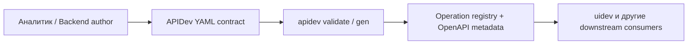
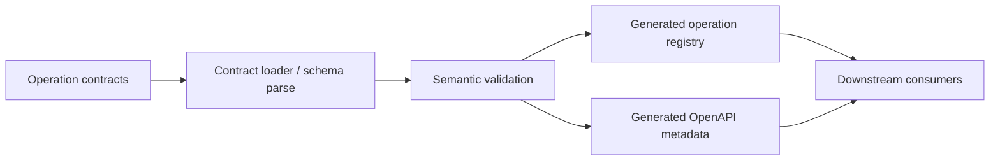
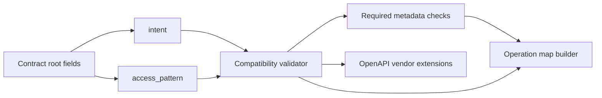

# Архитектура

## Level 1 — System Context

## Level 2 — Container

## Level 3 — Component

## Notes
- `intent` и `access_pattern` остаются operation-level metadata.
- Metadata обязательна для каждого operation contract; implicit derivation по HTTP method не используется.
- Downstream читает итоговые значения из generated metadata, а не повторно решает их локально.
